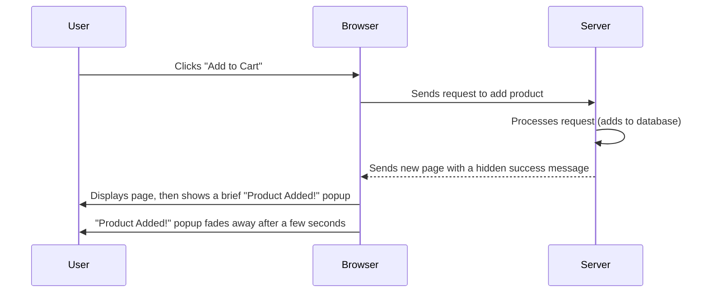

# Chapter 1: Flash Message System

Imagine you're shopping online. You click "Add to Cart" and the page refreshes. Did it work? Was the product added? Or did something go wrong? Without any feedback, you'd be left guessing!

This is where a **Flash Message System** comes in handy. It's like a helpful little sticky note that pops up on your screen, tells you what happened, and then gently fades away. It's perfect for quickly letting users know if an action was successful (like "Product added successfully!") or if there was an error (like "Login failed!"). These messages are "flash" because they appear for a short moment and then disappear, keeping your screen tidy.

This first chapter will teach you about this simple but powerful system.

## Why Do We Need Flash Messages?

When you interact with a website, many things happen "behind the scenes" on the server. For example:
*   Submitting a form (like login or signup).
*   Adding an item to a shopping cart.
*   Updating your profile details.
*   Deleting a product.

After these actions, the web server usually sends you to a new page or reloads the current one. If there's no message, you might wonder if your action actually worked. Flash messages solve this by providing immediate feedback.

Think of it like this:



## Core Ideas Behind Flash Messages

1.  **Temporary:** They don't stay on the screen forever.
2.  **Dismissible (often automatic):** They usually disappear by themselves after a short time.
3.  **Status-based:** They often come in different styles (e.g., green for success, red for error, blue for information).
4.  **One-time display:** A message shown once shouldn't magically reappear if you navigate to another page or refresh. This is key to the "flash" nature.

## How to Use the Flash Message System

In our `ecommercePHP` project, the Flash Message System works by combining a bit of PHP and a bit of JavaScript.

### Step 1: Tell PHP to Store a Message

When your PHP code finishes an action, it needs to store the message and its type (success, fail, info) so that the next page can display it. We use PHP's `$_SESSION` for this. Think of `$_SESSION` as a temporary storage area that follows a user across different pages of your website.

Here's how you might set a "success" message after a profile update:

```php
<?php
// Let's imagine this is inside 'user/process_profile_update.php'

session_start(); // Always start session to use $_SESSION

// ... (code to update user profile in the database) ...

if ($profile_update_successful) {
    $_SESSION['message-status'] = "success";
    $_SESSION['message'] = "Your profile has been updated successfully!";
    header("Location: profile.php"); // Go back to the profile page
    exit();
} else {
    $_SESSION['message-status'] = "fail";
    $_SESSION['message'] = "Failed to update profile. Please try again.";
    header("Location: edit-profile.php"); // Stay on edit page
    exit();
}
?>
```
**Explanation:**
*   `session_start();` is essential to use `$_SESSION`.
*   We set two session variables: `message-status` (like 'success', 'fail', 'info') and `message` (the text to show).
*   `header("Location: ...");` tells the browser to go to a different page. This is important because the message will be displayed on this *next* page.
*   `exit();` stops the script from running further.

### Step 2: Include the Flash Message Components on Your Page

Now, on the page where you want to *display* the message (like `user/profile.php`), you need to include two special files:

1.  `components/flashMessage.php`: This file contains the HTML container for the message and the JavaScript code that knows how to show and hide it.
2.  `components/show_flash_message.php`: This file is a small PHP script that checks if there's a message waiting in `$_SESSION` and, if so, generates the JavaScript call to display it. It also ensures the message is cleared from `$_SESSION` after being displayed.

Let's look at a simplified version of how this might appear in `user/profile.php`:

```php
<?php
// ... (start of user/profile.php) ...

include '../components/user_nav.php'; // Your navigation bar
include '../components/flashMessage.php'; // The message container and JS logic
include '../components/show_flash_message.php'; // PHP to trigger JS based on session

// ... (rest of your profile page HTML) ...
?>
```

**Explanation:**
*   When `user/profile.php` loads, `flashMessage.php` creates the invisible message box and the `setFlashMessage` function.
*   Then, `show_flash_message.php` runs. It checks if `$_SESSION['message-status']` and `$_SESSION['message']` exist. If they do, it tells the browser to run the `setFlashMessage` JavaScript function.
*   Crucially, `show_flash_message.php` then removes the message from `$_SESSION` (`unset($_SESSION['message-status']); unset($_SESSION['message']);`). This ensures the message only "flashes" once.

## How the System Works Internally

Let's peek under the hood to see how these two components work together.

```mermaid
sequenceDiagram
    participant PHP_Action_Script as Action Script (e.g., process_profile_update.php)
    participant PHP_Session as PHP Session ($_SESSION)
    participant Browser
    participant Display_Page as Display Page (e.g., profile.php)
    participant Show_Flash_PHP as show_flash_message.php
    participant Flash_Message_JS as flashMessage.php (JS)

    PHP_Action_Script->>PHP_Session: Store 'message-status' and 'message'
    PHP_Action_Script->>Browser: Redirect to Display_Page
    Browser->>Display_Page: Request Display_Page
    Display_Page->>Flash_Message_JS: Include flashMessage.php (HTML div & JS function ready)
    Display_Page->>Show_Flash_PHP: Include show_flash_message.php
    Show_Flash_PHP->>PHP_Session: Check for 'message-status' and 'message' (found!)
    Show_Flash_PHP->>Browser: Echoes <script>setFlashMessage('status', 'message');</script>
    Show_Flash_PHP->>PHP_Session: Unset 'message-status' and 'message' (clear for next time)
    Browser->>Flash_Message_JS: Executes setFlashMessage('status', 'message');
    Flash_Message_JS->>Browser: Displays message on screen (animates in)
    Flash_Message_JS->>Browser: Sets timer to hide message
    Flash_Message_JS->>Browser: Message fades out (animates out)
```

### 1. The Message Container (`components/flashMessage.php`)

This file contains the hidden HTML element that will become your flash message, along with the JavaScript function `setFlashMessage` that controls it.

```html
<!-- File: components/flashMessage.php -->
<div id="flash-mesg"
    class="absolute right-0 w-96 max-h-24 my-2 p-3 border-l-5 rounded-l-md overflow-y-hidden 
           bg-green-200 border-green-500 text-green-800 hidden">
</div>

<script>
    function setFlashMessage(state, mesg) {
        const flashMesgDiv = $("#flash-mesg"); // Get the message div using jQuery

        // 1. Change styling based on message state (success, fail, info)
        flashMesgDiv.removeClass('bg-red-100 border-red-400 text-red-800 bg-blue-100 border-blue-400 text-blue-800 bg-green-200 border-green-500 text-green-800');
        if (state == "success") {
            flashMesgDiv.addClass('bg-green-200 border-green-500 text-green-800');
        } else if (state == "fail") {
            flashMesgDiv.addClass('bg-red-100 border-red-400 text-red-800');
        } else if (state == "info") { // Note: original code used single =, fixed to ==
            flashMesgDiv.addClass('bg-blue-100 border-blue-400 text-blue-800');
        }
        
        // 2. Set the message text
        flashMesgDiv.text(mesg);

        // 3. Animate it to appear
        flashMesgDiv.animate({ width: 'toggle' }); // Make it visible

        // 4. Set a timer to hide it after 3.5 seconds
        setTimeout(() => {
            flashMesgDiv.animate({ width: 'toggle' }); // Hide it
        }, 3500);
    }
</script>
```

**Explanation:**
*   The `<div id="flash-mesg">` is the actual box that will show the message. It starts `hidden`.
*   The `setFlashMessage(state, mesg)` function is a JavaScript function that takes two inputs:
    *   `state`: This tells it whether the message is a "success", "fail", or "info".
    *   `mesg`: This is the actual text of the message (e.g., "Product added!").
*   Inside the function, it first removes any old styling, then applies new CSS classes (like `bg-green-200` for success) to change the background color, border, and text color.
*   It sets the text of the `div` to `mesg`.
*   It then uses jQuery's `animate({ width: 'toggle' })` to smoothly slide the message box into view.
*   Finally, `setTimeout()` is used to wait for 3.5 seconds (`3500` milliseconds) before animating the message box to slide back out and hide again. This is what makes it "flash"!

### 2. The Session Bridge (`components/show_flash_message.php`)

This simple PHP file acts as the bridge between your PHP `$_SESSION` variables and the JavaScript function defined above.

```php
<?php
// File: components/show_flash_message.php

// Check if a message and its status are stored in the session
if (isset($_SESSION['message-status']) && isset($_SESSION['message'])) {
    ?>
    <script>
        // Call the JavaScript function setFlashMessage with the stored values
        setFlashMessage("<?php echo $_SESSION['message-status'] ?>", "<?php echo $_SESSION['message'] ?>");
    </script>
    <?php
}

// IMPORTANT: Clear the message from the session immediately after displaying it
unset($_SESSION['message-status']); 
unset($_SESSION['message']);
?>
```

**Explanation:**
*   `if (isset($_SESSION['message-status']) && isset($_SESSION['message']))`: This line checks if there's any flash message data stored in the session.
*   If a message is found, it generates a `<script>` tag. Inside this tag, it calls the `setFlashMessage` JavaScript function, passing the status and message from the `$_SESSION` variables.
*   `unset($_SESSION['message-status']); unset($_SESSION['message']);`: This is the most crucial part for the "flash" behavior. Once the message has been read and prepared for display, it is immediately removed from the session. This prevents it from reappearing if the user navigates to another page or refreshes the current one.

## Conclusion

The Flash Message System is a foundational component for creating a user-friendly e-commerce site. It ensures that users always receive clear, timely feedback on their actions without cluttering the interface. By using PHP sessions to store the message and JavaScript to display it temporarily, we create an effective and unobtrusive notification system.

Now that you understand how to communicate status updates to your users, you're ready to dive into how your application connects to and manages its data.

[Next Chapter: Database Connection & Operations](02_database_connection___operations_.md)

---

<sub><sup>**References**: [[1]](https://github.com/Aatish250/ecommercePHP/blob/d76d2c3a68acff6cef47eb78bc43f653c53f1142/user/checkout.php), [[2]](https://github.com/Aatish250/ecommercePHP/blob/d76d2c3a68acff6cef47eb78bc43f653c53f1142/user/khalti-callback.php), [[3]](https://github.com/Aatish250/ecommercePHP/blob/d76d2c3a68acff6cef47eb78bc43f653c53f1142/user/khalti-payment.php), [[4]](https://github.com/Aatish250/ecommercePHP/blob/d76d2c3a68acff6cef47eb78bc43f653c53f1142/vendor/xentixar/khalti-sdk/README.md), [[5]](https://github.com/Aatish250/ecommercePHP/blob/d76d2c3a68acff6cef47eb78bc43f653c53f1142/vendor/xentixar/khalti-sdk/src/Khalti.php)</sup></sub>