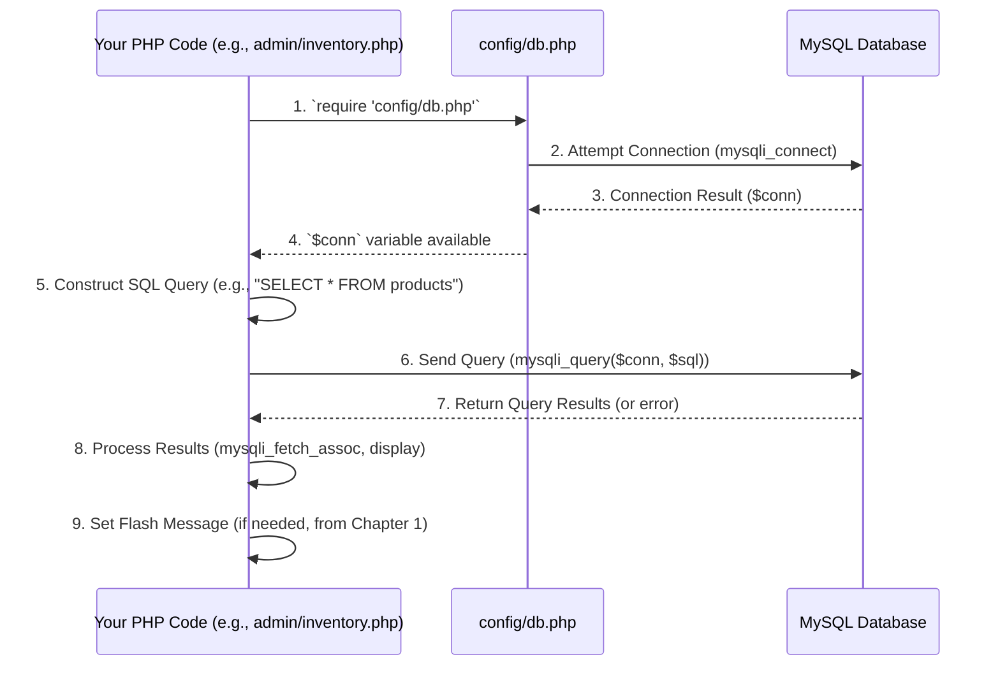

# Chapter 2: Database Connection & Operations

In [Chapter 1: Flash Message System](01_flash_message_system_.md), we learned how to give immediate, temporary feedback to users – like "Product added successfully!". That's great for quick messages, but what about the actual product? Where does the e-commerce store keep track of all its products, customer details, and past orders so they don't disappear when you close your browser or the server restarts?

This is where **Database Connection & Operations** comes in.

Imagine an e-commerce store without a good way to store its information. Every time you add a product, it would forget it! Every time a customer signs up, their account would vanish! That wouldn't be a very useful store, would it?

This system is like the main librarian for our entire e-commerce store. It manages all information about products, users, and orders, ensuring everything is correctly filed away and accessible when needed by any part of the application. It's the memory of our website, making sure all the important data is safe and sound.

## Why Do We Need a Database?

Websites need to remember information permanently. This is called **persistent storage**. A database provides a structured way to store, organize, and retrieve large amounts of data. For our `ecommercePHP` project, this includes:

*   **Products:** Names, prices, images, descriptions, stock levels.
*   **Users:** Account details, passwords (encrypted!), shipping addresses.
*   **Orders:** Who bought what, when, for how much, and their shipping status.
*   **Shopping Carts:** Which products a user has added before checkout.

Without a database, our e-commerce store wouldn't be able to function as a real store, because it would forget everything after a page refresh.

## Key Concepts

Let's break down the core ideas behind interacting with a database.

### 1. What is a Database?

Think of a database as a super-organized digital filing cabinet. Instead of paper, it stores data in **tables**, which are a bit like spreadsheets. Each table has columns (like categories of information, e.g., "Product Name," "Price") and rows (like individual records, e.g., "T-shirt," "$20").

Our project uses **MySQL**, a popular type of database designed to store and manage this kind of structured data efficiently.

### 2. Database Connection

Before you can ask the librarian (the database) for anything, you first need to get permission to enter the library! A **database connection** is the link your PHP application establishes with the MySQL database. It's like opening a secure line of communication.

### 3. Database Operations (CRUD)

Once connected, you can perform various actions on the data. These actions are often summarized by the acronym **CRUD**:

*   **C**reate: Adding new information (e.g., a new product).
*   **R**ead: Getting existing information (e.g., listing all products).
*   **U**pdate: Changing existing information (e.g., updating a product's stock).
*   **D**elete: Removing information (e.g., removing a product).

These operations are performed using a special language called **SQL** (Structured Query Language).

## How to Connect to the Database

In our `ecommercePHP` project, all the database connection magic happens in one central place: `config/db.php`. This makes it easy to manage and ensures all parts of your application use the same connection settings.

### File: `config/db.php`

```php
<?php
// This line connects to the MySQL database
// It takes 4 main pieces of information:
// 1. "localhost": The address of the database server (usually your own computer for development)
// 2. "root": The username to log in to the database
// 3. "": The password for that username (often empty for 'root' on development setups)
// 4. "ecom_db": The name of the specific database we want to use
$conn = mysqli_connect("localhost", "root", "", "ecom_db");

// This checks if the connection failed
if (!$conn) {
    die("Connection Error: " . mysqli_connect_error()); // Show error and stop if connection fails
}
?>
```

**Explanation:**
*   `mysqli_connect(...)`: This is a PHP function that tries to establish a connection to your MySQL database.
*   `$conn`: If the connection is successful, this variable will hold the connection object. You'll use this `$conn` object for all your database operations.
*   `if (!$conn)`: This is a crucial check. If the connection fails (e.g., wrong password, database server not running), `$conn` will be `false`, and the `die()` function will stop the script and show an error message. This prevents your website from trying to do database operations without a valid connection.

To use this connection in any other PHP file, you just need to `require` or `include` this `db.php` file:

```php
<?php
// In any PHP file that needs database access
require '../../config/db.php'; // This makes the $conn variable available

// Now you can use $conn for database operations!
// For example: mysqli_query($conn, "SELECT * FROM products");
?>
```

## How to Perform Database Operations

Once connected, we can perform CRUD operations. Let's look at examples from our project.

### 1. Reading Data (SELECT)

This is how you get information *out* of the database. For example, listing all products on the `admin/inventory.php` page.

**Example Use Case:** Display all products in the admin inventory.

```php
<?php
// File: admin/proccess/inventory_products.php (Simplified)

require '../../config/db.php'; // First, establish the database connection

$sql = "SELECT * FROM products"; // Our SQL query to get all product data
$result = mysqli_query($conn, $sql); // Run the query using our connection

// Check if any rows were returned
if (mysqli_num_rows($result) > 0) {
    // Loop through each row of data
    while ($row = mysqli_fetch_assoc($result)) {
        // $row will be an array like: ['product_id' => 1, 'product_name' => 'T-Shirt', ...]
        echo "Product Name: " . $row['product_name'] . ", Price: " . $row['product_price'] . "<br>";
    }
} else {
    echo "No products found.";
}

// Close the connection when you're done (good practice, though PHP usually closes it automatically)
mysqli_close($conn);
?>
```

**Explanation:**
*   `SELECT * FROM products`: This is the SQL query. `SELECT *` means "get all columns," and `FROM products` means "from the `products` table."
*   `mysqli_query($conn, $sql)`: This function sends your SQL query to the database using the `$conn` connection. It returns a **result set** if successful, which is like a list of all matching records.
*   `mysqli_num_rows($result)`: Checks how many rows (products, in this case) were found.
*   `while ($row = mysqli_fetch_assoc($result))`: This loop goes through each row in the result set. `mysqli_fetch_assoc()` takes one row and turns it into an **associative array** (where column names are the keys, like `['product_name' => 'T-Shirt']`).

### 2. Adding Data (INSERT)

This is how you put new information *into* the database. For example, an admin adding a new product.

**Example Use Case:** Add a new product to the `products` table.

```php
<?php
// File: admin/proccess/add_product.php (Simplified)

require '../../config/db.php'; // Establish connection

// Imagine these values come from a submitted form:
$name = "New Gadget";
$category = "Electronics";
$price = 49.99;
$stock = 100;
$description = "A cool new device.";
$fileName = "gadget.jpg"; // The image file name

$sql_product = "INSERT INTO `products`
    (`product_name`, `image`, `product_price`, `category`, `stock`, `description`)
    VALUES ('$name', '$fileName', '$price', '$category', '$stock', '$description')";

$result = mysqli_query($conn, $sql_product); // Execute the INSERT query

if ($result) {
    // If the query was successful, set a flash message (Chapter 1)
    $_SESSION['message-status'] = "success";
    $_SESSION['message'] = "Product Added Successfully!";
} else {
    $_SESSION['message-status'] = "fail";
    $_SESSION['message'] = "Failed to add product: " . mysqli_error($conn);
}

mysqli_close($conn);
// Then redirect the user, as discussed in Chapter 1
header("Location: ../inventory.php");
exit();
?>
```

**Explanation:**
*   `INSERT INTO `products` (...) VALUES (...)`: This SQL query specifies which table (`products`), which columns you're filling, and the values for those columns.
*   It's **very important** to properly sanitize (clean) any user input before putting it into an SQL query to prevent security vulnerabilities like SQL Injection. Our project uses `mysqli_real_escape_string` in some places, which helps, but prepared statements (which we'll see an example of later) are generally safer.
*   `mysqli_error($conn)`: If `mysqli_query` returns `false`, this function can give you details about the error.

### 3. Updating Data (UPDATE)

This is how you change existing information in the database. For example, updating the stock level of a product.

**Example Use Case:** An admin changes the stock of a product.

```php
<?php
// File: admin/proccess/inventory_products.php (Simplified, for UPDATE)

require '../../config/db.php'; // Establish connection

// Imagine these values come from a form:
$productId = 5;    // The ID of the product to update
$newStock = 75; // The new stock quantity

$sql = "UPDATE products SET stock = '$newStock' WHERE product_id = '$productId'";
$result = mysqli_query($conn, $sql); // Execute the UPDATE query

if ($result) {
    $_SESSION['message-status'] = "success";
    $_SESSION['message'] = "Stock updated for product ID: $productId";
} else {
    $_SESSION['message-status'] = "fail";
    $_SESSION['message'] = "Error updating stock: " . mysqli_error($conn);
}

mysqli_close($conn);
// After update, usually an AJAX call or redirect happens
?>
```

**Explanation:**
*   `UPDATE products SET stock = '$newStock' WHERE product_id = '$productId'`: This SQL query tells the database to change the `stock` column to `$newStock` *only for the row where `product_id` matches `$productId`*. The `WHERE` clause is crucial to ensure you update only the intended record.

### 4. Deleting Data (DELETE)

This is how you remove information from the database. For example, an admin deleting a product.

**Example Use Case:** An admin removes a product from the store.

```php
<?php
// File: admin/proccess/inventory_products.php (Simplified, for DELETE)

require '../../config/db.php'; // Establish connection

// Imagine this value comes from a form:
$productId = 3; // The ID of the product to delete

$sql = "DELETE FROM products WHERE product_id = '$productId'";
$result = mysqli_query($conn, $sql); // Execute the DELETE query

if ($result) {
    $_SESSION['message-status'] = "success";
    $_SESSION['message'] = "Product ID: $productId deleted successfully.";
    // In a real scenario, you'd also delete the image file from the server
} else {
    $_SESSION['message-status'] = "fail";
    $_SESSION['message'] = "Error deleting product: " . mysqli_error($conn);
}

mysqli_close($conn);
// After deletion, usually an AJAX call or redirect happens
?>
```

**Explanation:**
*   `DELETE FROM products WHERE product_id = '$productId'`: This SQL query tells the database to remove the entire row from the `products` table *where `product_id` matches `$productId`*. Again, the `WHERE` clause is vital to prevent accidentally deleting all products!

### Using Prepared Statements for Safety (Advanced but Important)

You might have noticed that we often put variables directly into our SQL queries. While this works, it can be dangerous if the variables come directly from user input without proper cleaning. This is called **SQL Injection**. A better, safer way is to use **prepared statements**.

Let's look at an example from `admin/proccess/orders_ajax.php` for updating an order status:

```php
<?php
// File: admin/proccess/orders_ajax.php (Example of prepared statement)

require_once '../../config/db.php'; // Establish connection

if (isset($_POST['order_id'], $_POST['new_status'])) {
    $order_id = intval($_POST['order_id']); // Ensure it's an integer
    $new_status = $_POST['new_status'];

    // 1. Prepare the SQL query with placeholders (?)
    $stmt = $conn->prepare("UPDATE orders SET status = ?, updated_at = NOW() WHERE order_id = ?");

    // 2. "Bind" the actual values to the placeholders
    // 'si' means 's'tring for new_status, 'i'nteger for order_id
    $stmt->bind_param('si', $new_status, $order_id);

    // 3. Execute the statement
    $success = $stmt->execute();

    // 4. Close the statement
    $stmt->close();

    // Now check $success and return a flash message or JSON response
    // ...
}
// ... rest of the file
?>
```

**Explanation:**
*   `$conn->prepare(...)`: Instead of executing the query directly, we first "prepare" it. The `?` acts as a placeholder for values that will be provided later. This tells MySQL to expect values and treats them as data, not as part of the SQL command itself, preventing injection.
*   `$stmt->bind_param('si', $new_status, $order_id)`: This is where you tell MySQL what types of data (`s` for string, `i` for integer) each `?` represents, and then provide the actual variables in order.
*   `$stmt->execute()`: This actually runs the prepared query with the bound values.
*   `$stmt->close()`: Always close the prepared statement to free up resources.

This method is highly recommended for any query that involves user input.

## How the Database System Works Internally

Let's look at a simplified journey of how your PHP application connects to and interacts with the database.



1.  **Your PHP Code** (like `admin/inventory.php`) starts running and needs to access product data.
2.  It uses `require '../../config/db.php'` to load the database configuration.
3.  Inside `config/db.php`, the `mysqli_connect()` function tries to establish a link to the **MySQL Database**.
4.  The **MySQL Database** either accepts or rejects the connection and sends back a connection object (or an error) to `config/db.php`.
5.  `config/db.php` then makes this connection object (named `$conn`) available to **Your PHP Code**.
6.  Now, **Your PHP Code** constructs an SQL query (e.g., to get all products).
7.  It then sends this query to the **MySQL Database** using `mysqli_query()` and the `$conn` object.
8.  The **MySQL Database** executes the query and sends the results (the list of products) back to **Your PHP Code**.
9.  **Your PHP Code** processes these results (e.g., loops through them using `mysqli_fetch_assoc`) to display them on the web page. If the operation was an INSERT, UPDATE, or DELETE, it might then [Set Flash Message](01_flash_message_system_.md) to tell the user if it was successful.

### Key Tables in `ecom_db`

Our `ecommercePHP` project uses several tables to organize data. Here are some of the most important ones, defined in `db/ecom_db.sql`:

| Table Name    | What it stores                                                |
| :------------ | :------------------------------------------------------------ |
| `products`    | All the items available for sale in the store.                |
| `users`       | Customer and admin account information.                       |
| `cart`        | Items that users have added to their shopping cart.           |
| `orders`      | Details about placed orders (who, when, total, status).       |
| `order_items` | Specific products within each order and their quantity/price. |

These tables are linked together using special `product_id`, `user_id`, `order_id` values (called "foreign keys") to maintain relationships between different pieces of data. For example, an `order_items` entry is linked to a `products` entry and an `orders` entry.

## Conclusion

Understanding Database Connection & Operations is fundamental to building any dynamic website, especially an e-commerce store. It's how your application remembers everything important, from the products you sell to the customers you serve and the orders they place. By connecting to MySQL and performing CRUD operations using PHP's `mysqli` functions (and preferably prepared statements!), you enable your store to manage its entire inventory and customer interactions persistently.

Now that we know how to store and retrieve data, our next step is to understand how to manage individual users, their logins, and what parts of the website they are allowed to access.

[Next Chapter: User Session & Access Control](03_user_session___access_control_.md)

---

<sub><sup>**References**: [[1]](https://github.com/Aatish250/ecommercePHP/blob/d76d2c3a68acff6cef47eb78bc43f653c53f1142/user/checkout.php), [[2]](https://github.com/Aatish250/ecommercePHP/blob/d76d2c3a68acff6cef47eb78bc43f653c53f1142/user/khalti-callback.php), [[3]](https://github.com/Aatish250/ecommercePHP/blob/d76d2c3a68acff6cef47eb78bc43f653c53f1142/user/khalti-payment.php), [[4]](https://github.com/Aatish250/ecommercePHP/blob/d76d2c3a68acff6cef47eb78bc43f653c53f1142/vendor/xentixar/khalti-sdk/README.md), [[5]](https://github.com/Aatish250/ecommercePHP/blob/d76d2c3a68acff6cef47eb78bc43f653c53f1142/vendor/xentixar/khalti-sdk/src/Khalti.php)</sup></sub>