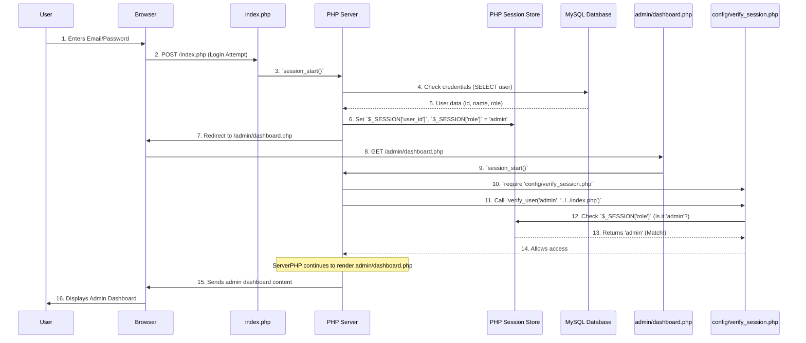

# Chapter 3: User Session & Access Control

In [Chapter 2: Database Connection & Operations](02_database_connection___operations_.md), we learned how our e-commerce store remembers everything – from products to customer accounts. But just because the information is *stored*, doesn't mean everyone should see or change it! Imagine walking into a physical store. The cashier won't just let you walk into the back room where they keep all the inventory and sales records, right?

This is exactly the problem that **User Session & Access Control** solves.

This system is like the security guard for our website. It first checks your ID (username and password) at the entrance (the login page). Once you're inside, it gives you a temporary "pass" (a user session) that identifies you. Based on who you are (a regular customer or an administrator), it then guides you to the areas you're allowed to see and use, blocking off sensitive areas for unauthorized people. This ensures that only the right people can do the right things on our website.

## Why Do We Need User Session & Access Control?

Without a system like this, anyone could:
*   Access admin-only pages to change product prices or delete orders.
*   See other users' private information (like shipping addresses).
*   Perform actions that require a login, like placing an order or managing their own profile.

User Session & Access Control provides:
*   **Personalization:** Remember who you are so the website can show your cart, your profile, etc.
*   **Security:** Prevent unauthorized users from accessing restricted parts of the website.
*   **Role Management:** Differentiate between different types of users (e.g., customers who buy, and admins who manage the store).

## Key Concepts

Let's break down the essential ideas that make this system work.

### 1. User Session

When you log into a website, the server needs a way to remember that you're logged in as you move from page to page. Since HTTP (the language of the web) is "stateless" (it forgets everything after each page request), we need a special mechanism.

A **User Session** is like a temporary memory card the server gives to your browser. This memory card holds a unique ID. Every time your browser asks for a new page, it shows this ID. The server then looks up the ID in its own records and remembers who you are, what your role is, and other important details.

In PHP, we use the `$_SESSION` superglobal array for this. It's a special global variable that persists across multiple pages for a single user.

**Important:** To use `$_SESSION`, you **must** call `session_start();` at the very beginning of any PHP script that needs to access session data.

### 2. Access Control

Once the website knows who you are (thanks to the session), **Access Control** determines what you're allowed to do or see. It's about setting rules like:

*   "Only users with the 'admin' role can go to `/admin/dashboard.php`."
*   "Only logged-in users can add items to a cart."
*   "A user can only view their *own* profile, not someone else's."

We achieve this by checking the user's role (stored in `$_SESSION`) against the requirements of the page they are trying to access.

### 3. User Roles

In our `ecommercePHP` project, we have distinct user roles:

| Role            | Description                                                            | Example Actions                                                     |
| :-------------- | :--------------------------------------------------------------------- | :------------------------------------------------------------------ |
| `user`          | A regular customer who can browse products, add to cart, place orders. | View product details, purchase items, manage their own profile.     |
| `admin`         | A store administrator with full control over the website's backend.    | Add/edit products, manage orders, view sales reports, manage users. |
| (Not logged in) | No specific role, treated as a public visitor.                         | Browse homepage, view product listings (but cannot buy).            |

These roles are stored in the database (in the `users` table) and, upon successful login, copied into the user's session (`$_SESSION['role']`).

## How to Manage User Sessions & Access Control

Let's see how this all comes together in our `ecommercePHP` project.

### 1. User Login (`index.php`)

The `index.php` file is the gateway to our website. It handles both user login and registration. When a user successfully logs in, the system creates their session.

```php
<?php
// File: index.php (simplified for login)
session_start(); // Always start the session first!
require_once "config/db.php"; // Connect to the database

// ... other code ...

// Handle login form submission
if ($_SERVER['REQUEST_METHOD'] === 'POST' && isset($_POST['form_type']) && $_POST['form_type'] === 'login') {
    $email = trim($_POST['email']);
    $password = $_POST['password'];

    // Use prepared statement to prevent SQL injection (from Chapter 2)
    $stmt = $conn->prepare("SELECT user_id, username, password, role, status FROM users WHERE email = ?");
    $stmt->bind_param("s", $email);
    $stmt->execute();
    $result = $stmt->get_result();

    if ($user = $result->fetch_assoc()) {
        if (password_verify($password, $user['password'])) { // Check hashed password
            // Login successful! Store important info in the session
            $_SESSION['user_id'] = $user['user_id'];
            $_SESSION['role'] = $user['role'];
            $_SESSION['username'] = $user['username'];

            // Redirect based on role
            if ($user['role'] === 'admin') {
                header("Location: admin/dashboard.php");
            } else { // Default to user role
                header("Location: user/homepage.php");
            }
            exit(); // Stop script execution after redirect
        } else {
            // Invalid password
            $_SESSION['message-status'] = "fail";
            $_SESSION['message'] = "Invalid email or password.";
        }
    } else {
        // User not found
        $_SESSION['message-status'] = "fail";
        $_SESSION['message'] = "Invalid email or password.";
    }
    $stmt->close();
    header("Location: index.php"); // Redirect back to login page to show message
    exit();
}
?>
```

**Explanation:**
*   `session_start();`: This crucial line makes `$_SESSION` available.
*   The code gets the email and password from the login form.
*   It queries the `users` table in the database (Chapter 2) to find a matching user.
*   `password_verify()` securely checks if the provided password matches the stored *hashed* password.
*   If login is successful, `$_SESSION['user_id']`, `$_SESSION['role']`, and `$_SESSION['username']` are set. This is the "pass" the user receives.
*   `header("Location: ...")`: The user is then redirected to the appropriate dashboard (`admin/dashboard.php` or `user/homepage.php`) based on their `$_SESSION['role']`.
*   If login fails, a [Flash Message](01_flash_message_system_.md) is set, and the user is redirected back to the login page to see it.

### 2. User Logout (`index.php`, `components/admin_nav.php`, `components/user_nav.php`)

Logging out simply means destroying the session, effectively taking away the user's "pass".

```php
<?php
// File: index.php (simplified for logout)
session_start(); // Still need to start session to access it

if(isset($_GET['logout']) && $_GET['logout'] == "true"){
    echo "Called to logout"; // For debugging, not usually shown
    session_unset();   // Remove all session variables
    session_destroy(); // Destroy the session data on the server
    header ("Location: ".$_SERVER['PHP_SELF']); // Redirect back to index.php (login page)
    exit();
}
// ... rest of index.php
?>
```

The logout button in navigation components triggers this:

```php
<!-- File: components/admin_nav.php (Logout button) -->
<form action="../"> <!-- Action points to the parent directory, which is index.php -->
    <button id="nav-link" name="logout" value="true" class="text-gray-400 hover:text-slate-900">Logout</button>
</form>

<!-- File: components/user_nav.php (Logout button, dynamically changes to Login if not logged in) -->
<form action="../">
    <button id="nav-link" name="logout" value="true" class="text-gray-400 hover:text-slate-900">
        <?php if(isset($_SESSION['role']) && $_SESSION['role'] !== "user" && $_SESSION['role'] !== "admin") echo "Log In"; else echo "Log Out"; ?>
    </button>
</form>
```

**Explanation:**
*   The logout button is a form that submits a `GET` request with `logout=true` to `index.php`.
*   `session_unset()`: This clears all variables from the `$_SESSION` array.
*   `session_destroy()`: This fully deletes the session data from the server.
*   The user is then redirected to `index.php`, which will show the login/signup forms since they are no longer logged in.

### 3. Protecting Pages (`config/verify_session.php`)

This is our "security guard" function. It checks if the current user has the required role to view a page.

```php
<?php
// File: config/verify_session.php
// Remember to call session_start() BEFORE including this file on any protected page!

function verify_user($role_for, $redirect_link){
    // Check if the user's role in the session matches the required role
    if(!isset($_SESSION['role']) || $_SESSION['role'] !== $role_for){
        // If not logged in OR role doesn't match, redirect them!
        $_SESSION['message-status'] = "fail";
        $_SESSION['message'] = "Access Denied: You do not have permission to view this page.";
        header("Location: $redirect_link");
        exit(); // Crucial: Stop execution to prevent further page rendering
    }
}
?>
```

**How to use `verify_user` on a protected page:**

```php
<?php
// File: admin/dashboard.php (Example of a protected admin page)
session_start(); // Always start session first!
require_once '../config/verify_session.php'; // Include the security guard function

// Now, call the function:
// Required role: 'admin'
// If not admin, redirect to: '../../index.php' (the login page)
verify_user('admin', '../../index.php');

// If the script reaches here, it means the user IS an admin!
require_once '../config/db.php';
// ... rest of your admin dashboard code ...
?>
```

**Explanation:**
*   On any page that needs protection (like `admin/dashboard.php`), you first `session_start()`.
*   Then, you `require_once` `config/verify_session.php`.
*   You call `verify_user('admin', '../../index.php');`. This tells the system: "This page needs an 'admin'. If the current user isn't an admin (or isn't logged in), send them to `index.php`."
*   If the user's `$_SESSION['role']` doesn't match, a [Flash Message](01_flash_message_system_.md) is set, and the `header("Location: ...")` performs the redirect. `exit()` stops the page from loading its content for unauthorized users.

### 4. Creating an Admin Account (`create_admin.php`)

This is a special script designed to create the *first* admin user in the system, typically run only once during setup.

```php
<?php
// File: create_admin.php (Simplified)
session_start();
require_once "config/db.php";

// ... validation and form processing ...

if ($_SERVER['REQUEST_METHOD'] === 'POST' && isset($_POST['form_type']) && $_POST['form_type'] === 'signup') {
    // ... get and validate form inputs (username, email, password, gender) ...
    $hashed_password = password_hash($signup_password, PASSWORD_DEFAULT);
    $role = "admin"; // THIS IS THE KEY PART: Setting the role to 'admin'

    $stmt_insert = $conn->prepare("INSERT INTO users (username, email, password, gender, role) VALUES (?, ?, ?, ?, ?)");
    if ($stmt_insert) {
        $stmt_insert->bind_param("sssss", $signup_username, $signup_email, $hashed_password, $signup_gender, $role);
        if ($stmt_insert->execute()) {
            // Admin created successfully, redirect to main login page
            header("Location: index.php"); // Assuming index.php is parent
            exit();
        } else {
            // Handle insertion error
        }
        $stmt_insert->close();
    } else {
        // Handle prepare error
    }
}
?>
```

**Explanation:**
*   This file provides a form to create a user. The key difference from a regular user signup is that it explicitly sets the `role` to `"admin"` when inserting into the `users` table.
*   After successful creation, it redirects to the main login page (`index.php`) so the new admin can log in.

## How the User Session & Access Control System Works Internally

Let's visualize the journey of a user trying to access an admin-only page.



1.  **User Login:** The user enters their credentials on `index.php`.
2.  **Database Check:** `index.php` (running on the **PHP Server**) verifies these credentials against the **MySQL Database**.
3.  **Session Creation:** If successful, the **PHP Server** creates a unique session for this user and stores their `user_id`, `role`, and `username` in the **PHP Session Store**.
4.  **Redirection:** The server then tells the **Browser** to go to the appropriate page based on the user's role (e.g., `admin/dashboard.php`).
5.  **Access Attempt:** The **Browser** requests `admin/dashboard.php`.
6.  **Session & Access Control Check:** `admin/dashboard.php` starts its own session and immediately includes and calls `config/verify_session.php`.
7.  **Role Verification:** `verify_session.php` checks the `$_SESSION['role']` against the required role for that page.
8.  **Access Granted/Denied:**
    *   If the roles match (e.g., user is 'admin' and page requires 'admin'), access is granted, and `admin/dashboard.php` continues to load and display its content.
    *   If roles don't match, `verify_session.php` sets a [Flash Message](01_flash_message_system_.md) and redirects the user to the `index.php` login page.

## Conclusion

User Session & Access Control is the backbone of security and personalization for our e-commerce site. By understanding how to manage user sessions with `$_SESSION`, differentiate roles, and protect pages with `verify_user`, you can build a secure and intuitive experience for both customers and administrators. This system ensures that our store knows who is doing what and keeps sensitive information and functionalities safe.

Now that we know how to connect to the database, provide user feedback, and manage who can access what, we can start building the core functionality of any e-commerce site: managing products!

[Next Chapter: Product & Inventory Management](04_product___inventory_management_.md)

---

<sub><sup>**References**: [[1]](https://github.com/Aatish250/ecommercePHP/blob/d76d2c3a68acff6cef47eb78bc43f653c53f1142/user/checkout.php), [[2]](https://github.com/Aatish250/ecommercePHP/blob/d76d2c3a68acff6cef47eb78bc43f653c53f1142/user/khalti-callback.php), [[3]](https://github.com/Aatish250/ecommercePHP/blob/d76d2c3a68acff6cef47eb78bc43f653c53f1142/user/khalti-payment.php), [[4]](https://github.com/Aatish250/ecommercePHP/blob/d76d2c3a68acff6cef47eb78bc43f653c53f1142/vendor/xentixar/khalti-sdk/README.md), [[5]](https://github.com/Aatish250/ecommercePHP/blob/d76d2c3a68acff6cef47eb78bc43f653c53f1142/vendor/xentixar/khalti-sdk/src/Khalti.php)</sup></sub>