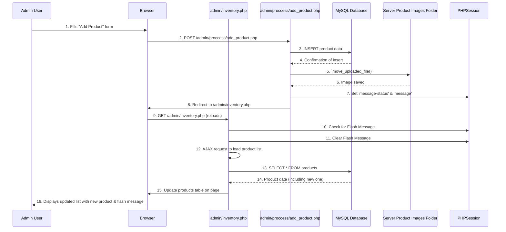

# Chapter 4: Product & Inventory Management

In [Chapter 3: User Session & Access Control](03_user_session___access_control_.md), we made sure only authorized people could access different parts of our e-commerce store. That's like having a security guard for our store. But what about the actual products we're selling? How do we put items on the shelves, change their prices, or mark them as "out of stock"?

This is where **Product & Inventory Management** comes in.

Imagine running a physical shop. You'd need a system to:
*   Add new items when they arrive from suppliers.
*   Update prices if they change.
*   Keep track of how many of each item you have (your inventory).
*   Remove items you no longer sell.
*   Display items nicely for customers to browse.

Our `ecommercePHP` system does all of this digitally. It's like the store's stock clerk and catalog manager rolled into one! It ensures all products are properly listed with correct information, tracks how many are available, and updates stock levels after purchases or returns.

## Why Do We Need Product & Inventory Management?

Without a proper product and inventory system, your e-commerce store simply can't function. You wouldn't be able to:
*   Show products to customers.
*   Sell anything (because you wouldn't know what you have or how much).
*   Keep track of what's popular or what needs restocking.
*   Manage different product details like images, descriptions, and categories.

This system is the heart of any online store, allowing it to offer goods for sale and manage them efficiently.

## Key Concepts

Let's break down the main ideas in managing products and their stock.

### 1. Product

In our system, a **product** is an item available for sale. Each product has several important details:
*   **Name:** What the product is called (e.g., "Cotton T-Shirt").
*   **Category:** What type of product it is (e.g., "Apparel", "Electronics").
*   **Price:** How much it costs.
*   **Description:** A detailed explanation of the product.
*   **Image:** A picture to show customers what it looks like.
*   **Stock:** How many of this product are currently available.

All these details are stored in the `products` table in our database (as discussed in [Chapter 2: Database Connection & Operations](02_database_connection___operations_.md)).

### 2. Inventory

**Inventory** refers to the total number of products you have on hand. For each product, its "stock" value is its current inventory count.

Managing inventory means:
*   **Updating stock:** Reducing it when a product is sold, increasing it when new stock arrives.
*   **Monitoring stock levels:** Knowing when products are running low (e.g., "Low Stock" alert).

Accurate inventory is crucial to avoid selling items you don't have (leading to unhappy customers) or having too much unsold stock.

### 3. Management Operations

Just like with other data, we perform **CRUD** operations on our products:
*   **Create (Add):** Introduce new products to the store.
*   **Read (View/List):** Display products for customers or for admin review.
*   **Update:** Change product details like price, description, or stock.
*   **Delete:** Remove products no longer sold.

## How to Manage Products and Inventory

In our `ecommercePHP` project, administrators handle product and inventory management through the `admin/inventory.php` page. This page lets them add new products, see all existing products, update their stock, and even delete them.

Let's walk through these actions.

### 1. Adding a New Product

When new items arrive, an admin needs to add them to the system.

**Location:** `admin/inventory.php` (for the form) and `admin/proccess/add_product.php` (for processing).

1.  **Admin View:** On `admin/inventory.php`, an admin clicks the "Add New Product" button. This reveals a form.
2.  **Filling the Form:** The admin fills in details like product name, category, price, stock, description, and uploads an image.
3.  **Submitting the Form:** When the form is submitted, the data goes to `admin/proccess/add_product.php`.

Here's how `admin/proccess/add_product.php` processes the new product:

```php
<?php
// File: admin/proccess/add_product.php (Simplified)
session_start();
require '../../config/db.php'; // Connect to the database

if (isset($_POST['add_product'])) {
    // Get product details from the form
    $name = $_POST['name'];
    $category = $_POST['category'];
    $price = $_POST['price'];
    $stock = $_POST['stock'];
    $description = $_POST['description'];
    
    // Handle image upload
    $file_name = $_FILES['image']['name'];
    $file_tmp = $_FILES['image']['tmp_name'];
    $upload_path = "../../img/product/" . $file_name;

    // Insert product details into the database
    $sql = "INSERT INTO `products` (`product_name`, `image`, `product_price`, 
            `category`, `stock`, `description`)
            VALUES ('$name', '$file_name', '$price', '$category', '$stock', '$description')";
    
    $result = mysqli_query($conn, $sql);

    if ($result && move_uploaded_file($file_tmp, $upload_path)) {
        $_SESSION['message-status'] = "success";
        $_SESSION['message'] = "Product '$name' added successfully!";
    } else {
        $_SESSION['message-status'] = "fail";
        $_SESSION['message'] = "Failed to add product or upload image.";
    }
    header('Location: ../inventory.php'); // Redirect back to inventory page
    exit();
}
?>
```

**Explanation:**
*   It starts a session and connects to the database ([Chapter 2: Database Connection & Operations](02_database_connection___operations_.md)).
*   It collects all the input fields, including the image file.
*   `$_FILES['image']['name']` is the original name of the uploaded image.
*   `$_FILES['image']['tmp_name']` is the temporary location where PHP stores the uploaded file.
*   The `INSERT INTO` SQL query adds a new row to the `products` table with all the product details.
*   `move_uploaded_file()` moves the temporary image file to its permanent location (`../../img/product/`).
*   A [Flash Message](01_flash_message_system_.md) is set to inform the admin about the success or failure of the operation.
*   The admin is redirected back to `admin/inventory.php` to see the updated list.

### 2. Listing Products (Admin View)

Admins need to see all products in a structured way to manage them.

**Location:** `admin/inventory.php` displays the table, and `admin/proccess/inventory_products.php` fetches the data.

The `admin/inventory.php` page uses AJAX (a way to load parts of a page without a full reload) to get product data from `admin/proccess/inventory_products.php`.

Here's a simplified look at how `admin/proccess/inventory_products.php` fetches and displays products when accessed without specific update/delete requests:

```php
<?php
// File: admin/proccess/inventory_products.php (Simplified - Listing part)
require '../../config/db.php'; // Connect to the database
session_start(); // To display flash messages if any

// ... (code for handling update/delete requests, omitted for listing example) ...

$sql = "SELECT * FROM products ORDER BY product_id DESC"; // Get all products
$result = mysqli_query($conn, $sql);

if (mysqli_num_rows($result) > 0) {
    while ($row = mysqli_fetch_assoc($result)) {
        // Echo HTML table row for each product
        echo "<tr data-product-id='{$row['product_id']}'>";
        echo "<td class='w-16 h-16'></td>";
        echo "<td class='p-2 font-medium'>{$row['product_name']}</td>";
        echo "<td class='text-sm text-center'>{$row['category']}</td>";
        echo "<td class='text-center'>Rs. {$row['product_price']}</td>";
        echo "<td class='text-center'><input type='hidden' name='db_stock' value='{$row['stock']}'>";
        echo "<input type='number' name='new_stock' value='{$row['stock']}' min='0' class='w-12'></td>";
        echo "<td class='text-center'>";
        echo "<button type='button' name='update_stock' class='px-3 py-2'>Update</button>";
        echo "<button type='submit' name='delete_product' class='px-3 py-2'>Delete</button>";
        echo "</td></tr>";
    }
} else {
    echo "<td colspan='100%' class='text-center'>No products found.</td>";
}

include "../../components/show_flash_message.php"; // Display any flash message
?>
```

**Explanation:**
*   It connects to the database.
*   The `SELECT * FROM products` SQL query retrieves all product details.
*   It then loops through each product (`while ($row = mysqli_fetch_assoc($result))`) and generates an HTML `<tr>` (table row) with all the product's information, including its image, name, category, price, and current stock.
*   It also includes input fields for `new_stock` and buttons for "Update" and "Delete," allowing for direct interaction from the table.
*   Any [Flash Message](01_flash_message_system_.md) waiting from a previous action is displayed.

### 3. Updating Product Stock

Admins can quickly change the stock quantity for any product directly from the inventory list.

**Location:** `admin/inventory.php` (for the interactive table) and `admin/proccess/inventory_products.php` (for processing).

On `admin/inventory.php`, when an admin changes the number in the "Stock" input field for a product, an "Update" button appears. Clicking this button sends an AJAX request to update the product.

Here's how `admin/proccess/inventory_products.php` handles updating product stock:

```php
<?php
// File: admin/proccess/inventory_products.php (Simplified - Update part)
require '../../config/db.php';
session_start();

if (isset($_POST['update_product_id']) && isset($_POST['new_stock_value'])) {
    $productId = mysqli_real_escape_string($conn, $_POST['update_product_id']);
    $newStock = mysqli_real_escape_string($conn, $_POST['new_stock_value']);

    $sql = "UPDATE products SET stock = '$newStock' WHERE product_id = '$productId'";
    $result = mysqli_query($conn, $sql);

    if ($result) {
        $_SESSION['message-status'] = "success";
        $_SESSION['message'] = "Stock updated for product ID: $productId.";
    } else {
        $_SESSION['message-status'] = "fail";
        $_SESSION['message'] = "Error updating stock.";
        http_response_code(500); // Indicate server error for AJAX
    }
    exit(); // Stop script execution after handling AJAX request
}

// ... (rest of the file for listing products, etc.) ...
?>
```

**Explanation:**
*   This part of the script is triggered when an AJAX POST request sends `update_product_id` and `new_stock_value`.
*   `mysqli_real_escape_string()` is used to make the input safe for the SQL query, preventing [SQL Injection](02_database_connection___operations_.md).
*   The `UPDATE` SQL query changes the `stock` value for the specific `product_id`. The `WHERE` clause is crucial to ensure only the intended product is updated.
*   A [Flash Message](01_flash_message_system_.md) is set, and `exit()` stops the script as it's an AJAX request (it doesn't need to render a full page).

### 4. Deleting a Product

If a product is discontinued or no longer available, an admin can delete it.

**Location:** `admin/inventory.php` (for the delete button) and `admin/proccess/inventory_products.php` (for processing).

On `admin/inventory.php`, clicking the "Delete" button for a product sends an AJAX request.

Here's how `admin/proccess/inventory_products.php` handles deleting a product:

```php
<?php
// File: admin/proccess/inventory_products.php (Simplified - Delete part)
require '../../config/db.php';
session_start();

// ... (code for handling update requests, omitted) ...

if (isset($_POST['delete_product_id'])) {
    $productId = mysqli_real_escape_string($conn, $_POST['delete_product_id']);
    
    // First, get the image name to delete the file
    $image_res = mysqli_query($conn, "SELECT image FROM products WHERE product_id = '$productId'");
    $image_data = mysqli_fetch_assoc($image_res);
    $image_path = "../../img/product/" . $image_data['image'];

    // Delete the product from the database
    $sql = "DELETE FROM products WHERE product_id = '$productId'";
    $result = mysqli_query($conn, $sql);

    if ($result) {
        // If database deletion is successful, try to delete the image file
        if (file_exists($image_path) && unlink($image_path)) {
            $_SESSION['message-status'] = "success";
            $_SESSION['message'] = "Product ID: $productId and its image deleted.";
        } else {
            $_SESSION['message-status'] = "fail";
            $_SESSION['message'] = "Product ID: $productId deleted from DB, but image file not found or could not be deleted.";
        }
    } else {
        $_SESSION['message-status'] = "fail";
        $_SESSION['message'] = "Error deleting product from database.";
        http_response_code(500);
    }
    exit();
}

// ... (rest of the file for listing products, etc.) ...
?>
```

**Explanation:**
*   This part is triggered when an AJAX POST request sends `delete_product_id`.
*   It first retrieves the image file name associated with the product from the database.
*   The `DELETE FROM` SQL query removes the product row from the `products` table. The `WHERE` clause is critical to target only the correct product.
*   `unlink($image_path)` attempts to delete the actual image file from the server's file system.
*   [Flash Messages](01_flash_message_system_.md) provide feedback on both database and file deletion.
*   `exit()` stops the script.

### 5. Viewing Products (Customer Perspective)

While the admin manages products, customers simply browse and view them.
*   `user/homepage.php` displays a grid of products, often with filters and search options. This page loads products using an AJAX request to `user/proccess/home_products.php` (similar to admin listing, but without management controls).
*   `user/product_detail.php` shows a single product's full description and image when a customer clicks on it. This page fetches the product details using a `SELECT` query based on the `product_id` passed in the URL.

These user-facing pages primarily *read* product data, which is made available by the admin's management actions.

## How the Product & Inventory Management System Works Internally

Let's trace how an admin adds a new product, from clicking a button to seeing it in the list.



1.  **Admin fills form:** The admin provides product details and an image in the form on `admin/inventory.php`.
2.  **Form Submission:** When submitted, the browser sends this data to `admin/proccess/add_product.php`.
3.  **Database Insertion:** `add_product.php` (running on the server) first inserts the product's text details (name, price, etc.) into the `products` table in the **MySQL Database**.
4.  **Image Upload:** Next, it takes the uploaded image file (which was temporarily stored by PHP) and permanently moves it to the `img/product/` folder on the **Server Files** system.
5.  **Feedback:** It sets a [Flash Message](01_flash_message_system_.md) in the PHP Session to indicate success or failure.
6.  **Redirection:** `add_product.php` then redirects the browser back to `admin/inventory.php`.
7.  **Page Reload and Display:** `admin/inventory.php` reloads, picks up any waiting flash message, and then uses an AJAX call to `admin/proccess/inventory_products.php` to fetch the *latest* list of products from the **MySQL Database**. This updated list, including the newly added product, is then displayed to the admin.

This entire flow ensures that the database and file system are updated, and the admin receives immediate feedback and an updated view of the inventory.

## Conclusion

Product & Inventory Management is the backbone of any e-commerce store, enabling you to bring your digital shelves to life. By understanding how to use PHP to add, list, update, and delete products, and how this interacts with both the database and the server's file system for images, you've grasped a core aspect of running an online shop. This system allows you to keep track of every item, ensuring your store is always ready for business.

Now that we know how to manage our products, the next step is to understand how customers can actually buy them!

[Next Chapter: Shopping Cart Logic](05_shopping_cart_logic_.md)

---

<sub><sup>**References**: [[1]](https://github.com/Aatish250/ecommercePHP/blob/d76d2c3a68acff6cef47eb78bc43f653c53f1142/user/checkout.php), [[2]](https://github.com/Aatish250/ecommercePHP/blob/d76d2c3a68acff6cef47eb78bc43f653c53f1142/user/khalti-callback.php), [[3]](https://github.com/Aatish250/ecommercePHP/blob/d76d2c3a68acff6cef47eb78bc43f653c53f1142/user/khalti-payment.php), [[4]](https://github.com/Aatish250/ecommercePHP/blob/d76d2c3a68acff6cef47eb78bc43f653c53f1142/vendor/xentixar/khalti-sdk/README.md), [[5]](https://github.com/Aatish250/ecommercePHP/blob/d76d2c3a68acff6cef47eb78bc43f653c53f1142/vendor/xentixar/khalti-sdk/src/Khalti.php)</sup></sub>