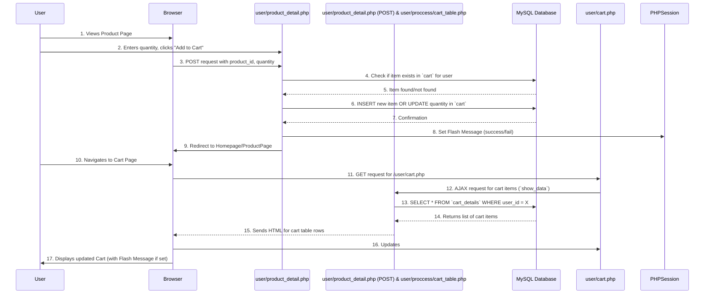

# Chapter 5: Shopping Cart Logic

In [Chapter 4: Product & Inventory Management](04_product___inventory_management_.md), we learned how store administrators can add, update, and manage all the products available in our e-commerce shop. That's like setting up the shelves and putting items on display in a physical store. But once the products are there, how do customers pick them out and collect them before making a purchase?

This is where **Shopping Cart Logic** comes in!

Imagine you're at a grocery store. You grab a physical shopping basket or cart, and as you walk around, you put all the items you want to buy into it. You might pick up a few apples, then realize you only need one, so you put two back. Eventually, when you're done, you take your full basket to the checkout counter.

Our `ecommercePHP` project's shopping cart system works just like this virtual shopping basket. It's an essential part of any online store because it allows users to:
*   Collect multiple items they intend to buy.
*   Change their mind about quantities.
*   Remove items they no longer want.
*   See a running total of their selections.
*   Prepare their chosen items for the final payment process.

It acts as a temporary holding area, making sure that only available products can be added and purchased, providing a smooth and flexible shopping experience for our users.

## Why Do We Need a Shopping Cart?

Without a shopping cart, users would have to buy each item individually, which is incredibly inconvenient! Or, worse, they might not be able to collect items at all. The shopping cart provides:
*   **Convenience:** Users can browse freely and add items as they go.
*   **Flexibility:** Easily adjust quantities or remove items before committing.
*   **Summary:** Provides a clear overview of what they're about to buy and the total cost.
*   **Bridge to Checkout:** It's the critical step between browsing products and placing an order.

## Key Concepts

Let's break down the main ideas behind our shopping cart system.

### 1. The Cart Itself

The "cart" is a collection of products that a specific user has chosen. It's usually temporary, meaning it exists for that user until they either complete their purchase (checkout) or explicitly remove all items.

Our system stores these chosen items in a database table called `cart`. Each entry in this table links a specific `user_id` to a `product_id` and records the `quantity` of that product the user wants.

### 2. User-Specific Items

Crucially, each user has *their own* cart. What you put in your cart doesn't affect what another user has in theirs. This is managed by associating each cart item with a `user_id` (which comes from the user's session, as we learned in [Chapter 3: User Session & Access Control](03_user_session___access_control_.md)).

### 3. Inventory Check

Before an item is added to the cart, or certainly before checkout, the system needs to check if there's enough *actual stock* of that product available in the store's inventory. This prevents a user from trying to buy 10 T-shirts when only 5 are left (refer back to [Chapter 4: Product & Inventory Management](04_product___inventory_management_.md)).

### 4. Cart Operations (The CRUD for your Basket)

Just like managing products or user data, we perform operations on the cart:

| Operation           | Description                                                                  | Database Action      |
| :------------------ | :--------------------------------------------------------------------------- | :------------------- |
| **Add Item**        | Put a new product into the cart, or increase quantity if it's already there. | `INSERT` or `UPDATE` |
| **View Cart**       | Display all products currently in the user's cart.                           | `SELECT`             |
| **Update Quantity** | Change the number of a specific item in the cart.                            | `UPDATE`             |
| **Remove Item**     | Take a product completely out of the cart.                                   | `DELETE`             |

## How to Implement Shopping Cart Logic

Let's see how our `ecommercePHP` project handles these cart operations, starting from when a customer first sees a product.

### 1. Adding a Product to the Cart

When a user is on a product's detail page (`user/product_detail.php`) and decides they want to buy it, they will specify a quantity and click an "Add to Cart" button.

**Where it happens:**
*   `user/product_detail.php` (for the button and form)
*   `user/product_detail.php` (for processing the form submission)

Here's a simplified version of the logic inside `user/product_detail.php` that handles adding an item:

```php
<?php
// File: user/product_detail.php (Simplified Add to Cart logic)
session_start(); // Essential for user_id from session
require '../config/db.php'; // Database connection

if (isset($_POST['add_to_cart'])) {
    $quantity = $_POST['quantity'];
    $product_id = $_POST['product_id'];
    $user_id = $_SESSION['user_id']; // Get current user's ID

    // Check if item already exists in cart for this user
    $existItemQuery = "SELECT * FROM cart WHERE user_id = $user_id AND product_id = $product_id";
    $existItemResult = mysqli_query($conn, $existItemQuery);

    if (mysqli_num_rows($existItemResult) > 0) {
        // If item exists, update its quantity
        $sql = "UPDATE cart SET quantity = $quantity WHERE user_id = $user_id AND product_id = $product_id";
        $_SESSION['message'] = "Quantity updated in cart!";
    } else {
        // If item is new, insert it into the cart
        $sql = "INSERT INTO cart (user_id, product_id, quantity) VALUES ($user_id, $product_id, $quantity)";
        $_SESSION['message'] = "Product added to cart!";
    }

    $sendResult = mysqli_query($conn, $sql); // Execute the query

    if ($sendResult) {
        $_SESSION['message-status'] = 'success'; // Set flash message (Chapter 1)
    } else {
        $_SESSION['message-status'] = 'fail';
        $_SESSION['message'] = "Error adding to cart.";
    }
    header('Location: homepage.php'); // Redirect after action
    exit();
}
// ... rest of product_detail.php
?>
```

**Explanation:**
*   `session_start();` ensures we can access `$_SESSION['user_id']` for the current user (from [Chapter 3: User Session & Access Control](03_user_session___access_control_.md)).
*   The code first checks if the product is already in the user's cart using a `SELECT` query.
*   If it is, an `UPDATE` query changes the quantity.
*   If not, an `INSERT` query adds a new item to the `cart` table in the database ([Chapter 2: Database Connection & Operations](02_database_connection___operations_.md)).
*   A [Flash Message](01_flash_message_system_.md) is set to inform the user, and they are redirected.

### 2. Viewing the Shopping Cart

After adding items, users expect to see a summary of their cart. This happens on the `user/cart.php` page.

**Where it happens:**
*   `user/cart.php` (for the page structure and JavaScript)
*   `user/proccess/cart_table.php` (an AJAX endpoint to fetch and render cart data)

The `user/cart.php` page uses JavaScript (specifically jQuery's `.load()` method) to fetch the actual cart items dynamically from `user/proccess/cart_table.php` without a full page reload.

Here's how `user/proccess/cart_table.php` would fetch and display the cart items:

```php
<?php
// File: user/proccess/cart_table.php (Simplified View Cart logic)
require '../../config/db.php';
session_start();
$user_id = $_SESSION['user_id'];

if (isset($_POST['show_data'])) { // This condition is true when AJAX requests data
    // Use a database VIEW called `cart_details` for simplified access
    // This VIEW joins `cart` with `products` to get product names, images, prices, etc.
    $cartResult = mysqli_query($conn, "SELECT * FROM cart_details WHERE user_id = $user_id");

    if (mysqli_num_rows($cartResult) > 0) {
        while ($cartRow = mysqli_fetch_assoc($cartResult)) {
            // Echo HTML table rows for each cart item
            echo "<tr data-product-id='{$cartRow['product_id']}'>";
            echo "<td class='w-24 h-24'></td>";
            echo "<td class='p-2'>{$cartRow['product_name']}</td>";
            echo "<td class='text-center'>Rs. {$cartRow['product_price']}</td>";
            echo "<td class='text-center'>";
            echo "<input type='number' name='new_quantity' value='{$cartRow['quantity']}' min='0' max='{$cartRow['stock']}' class='w-12'>";
            echo "</td>";
            echo "<td class='text-center'>Rs. " . ($cartRow['quantity'] * $cartRow['product_price']) . "</td>";
            echo "<td class='text-center'>";
            echo "<button type='submit' name='update_from_cart' class='px-3 py-2'>Update</button>";
            echo "<button type='submit' name='delete_from_cart' class='px-3 py-2'>Delete</button>";
            echo "</td></tr>";
            // ... (also checks for stock availability) ...
        }
    } else {
        echo "<tr><td colspan='7' class='text-center p-2 text-gray-400'>- -- --- No Items in Cart --- -- -</td></tr>";
    }
}
?>
```

**Explanation:**
*   It fetches all items from the `cart_details` database view (which is a pre-defined query that combines data from `cart` and `products` tables).
*   It then loops through each item and generates HTML table rows (`<tr>`) to display the product image, name, price, current quantity (with an input field for editing), and the subtotal for that item.
*   Buttons for "Update" and "Delete" are included next to each item, allowing users to interact with their cart directly.
*   Crucially, `max='{$cartRow['stock']}'` is set on the quantity input, ensuring users can't request more than what's available (an inventory check!).

### 3. Updating Item Quantity in the Cart

On the `user/cart.php` page, users can change the quantity of an item directly in the input field. When they click the "Update" button for that item, an AJAX request is sent.

**Where it happens:**
*   `user/cart.php` (JavaScript handles the click and AJAX)
*   `user/proccess/cart_table.php` (PHP processes the AJAX request)

Here's the relevant part of `user/proccess/cart_table.php` that handles quantity updates:

```php
<?php
// File: user/proccess/cart_table.php (Simplified Update Quantity logic)
require '../../config/db.php';
session_start();

if (isset($_POST['update_product_id']) && isset($_POST['new_stock_value'])) {
    $productId = mysqli_real_escape_string($conn, $_POST['update_product_id']);
    $newQuantity = mysqli_real_escape_string($conn, $_POST['new_stock_value']);
    $userId = $_SESSION['user_id'];

    // Update the quantity in the cart table
    $sql = "UPDATE cart SET quantity = '$newQuantity' WHERE product_id = '$productId' AND user_id = '$userId'";
    $result = mysqli_query($conn, $sql);

    if ($result) {
        $_SESSION['message-status'] = "success";
        $_SESSION['message'] = "Cart quantity updated!";
    } else {
        http_response_code(500); // Send an error status for AJAX
        $_SESSION['message-status'] = "fail";
        $_SESSION['message'] = "Error updating cart quantity.";
    }
    exit(); // Important for AJAX requests to prevent rendering full page
}
// ... rest of cart_table.php
?>
```

**Explanation:**
*   This code runs when an AJAX `POST` request provides `update_product_id` and `new_stock_value`.
*   `mysqli_real_escape_string()` is used to prevent [SQL Injection](02_database_connection___operations_.md).
*   An `UPDATE` SQL query is executed to change the `quantity` for the specific `product_id` and `user_id` in the `cart` table.
*   A [Flash Message](01_flash_message_system_.md) provides feedback, and `exit()` stops further script execution as it's an AJAX request.

### 4. Removing an Item from the Cart

Users can also remove an item entirely from their cart by clicking a "Delete" button. This also uses an AJAX request.

**Where it happens:**
*   `user/cart.php` (JavaScript for click and AJAX)
*   `user/proccess/cart_table.php` (PHP processes the AJAX request)

Here's the relevant part of `user/proccess/cart_table.php` for deleting items:

```php
<?php
// File: user/proccess/cart_table.php (Simplified Remove Item logic)
require '../../config/db.php';
session_start();

if (isset($_POST['delete_product_id'])) {
    $productId = mysqli_real_escape_string($conn, $_POST['delete_product_id']);
    $userId = $_SESSION['user_id'];

    // Delete the item from the cart table
    $sql = "DELETE FROM cart WHERE product_id = '$productId' AND user_id = '$userId'";
    $result = mysqli_query($conn, $sql);

    if ($result) {
        $_SESSION['message-status'] = "success";
        $_SESSION['message'] = "Item removed from cart!";
    } else {
        http_response_code(500);
        $_SESSION['message-status'] = "fail";
        $_SESSION['message'] = "Error removing item from cart.";
    }
    exit();
}
// ... rest of cart_table.php
?>
```

**Explanation:**
*   This code runs when an AJAX `POST` request provides `delete_product_id`.
*   A `DELETE` SQL query removes the row corresponding to the `product_id` and `user_id` from the `cart` table.
*   [Flash Message](01_flash_message_system_.md) feedback and `exit()`.

### 5. Proceeding to Checkout

Once a user is satisfied with their cart, they proceed to checkout. The `user/cart.php` page has a "Proceed to Checkout" button that links to `user/checkout.php`. This link can pass the `cart_id`s of selected items as a `GET` parameter if the user chose specific items, or process the entire cart.

**Where it happens:**
*   `user/cart.php` (the "Proceed to Checkout" button)
*   `user/checkout.php` (the page that loads to begin the order process)

The `user/checkout.php` page immediately re-checks inventory and displays an order summary.

```php
<?php
// File: user/checkout.php (Simplified initial load and stock check)
session_start();
require '../config/db.php';

// Get current user's ID
$user_id = $_SESSION['user_id'];

// Determine which cart items to load (all or selected)
$whereClause = "";
if (isset($_GET['selected_cart_ids'])) {
    $selected_cart_id_string = mysqli_real_escape_string($conn, $_GET['selected_cart_ids']);
    $whereClause = " AND cart_id IN ($selected_cart_id_string)";
}

// Fetch cart details for checkout summary
$cartDetailQuery = "SELECT * FROM cart_details WHERE user_id = $user_id $whereClause";
$cartDetailResult = mysqli_query($conn, $cartDetailQuery);

if (mysqli_num_rows($cartDetailResult) == 0) {
    echo "No items found in cart for checkout.";
    exit();
}

$cart_details = [];
while ($row = mysqli_fetch_assoc($cartDetailResult)) {
    $cart_details[] = $row;
}

// Check stock for all items in the cart
$checkAllQuantityInRange = true;
foreach ($cart_details as $cart_item) {
    if ($cart_item['stock'] < $cart_item['quantity'] || $cart_item['stock'] == 0) {
        $checkAllQuantityInRange = false; // Found an item with insufficient stock
        break;
    }
}

if (!$checkAllQuantityInRange) {
    echo '<p class="text-red-600 text-center">Some items in your cart are out of stock or have insufficient quantity. Please update your cart.</p>';
    // Optionally redirect back to cart.php
    // header("Location: cart.php");
    // exit();
}

// ... rest of checkout.php form for shipping, payment, totals ...
// The actual order placement happens upon form submission on checkout.php,
// which is a bridge to Chapter 6.
?>
```

**Explanation:**
*   The checkout page first retrieves the `user_id` and checks if specific `cart_id`s were passed from the `cart.php` page.
*   It then queries the `cart_details` view to get all the items relevant for this checkout process.
*   A crucial loop iterates through `cart_details` to verify that `cart_item['stock']` (available inventory) is greater than or equal to `cart_item['quantity']` (user's requested quantity). If any item doesn't meet this, `checkAllQuantityInRange` becomes `false`.
*   If `checkAllQuantityInRange` is `false`, the user is informed about the stock issue, preventing them from ordering unavailable items.
*   This also highlights the strong dependency on [Chapter 4: Product & Inventory Management](04_product___inventory_management_.md) for accurate stock levels.

## How the Shopping Cart Logic Works Internally

Let's trace the journey of a user adding an item and then viewing their cart.



1.  **User Adds Item:** The user selects a product and quantity on `user/product_detail.php` and clicks "Add to Cart".
2.  **Server Processes Add:** The browser sends a `POST` request to `user/product_detail.php`. This script checks the `cart` table in the **MySQL Database** to see if the item is already there for this user.
3.  **Database Update:** Depending on the check, it either `INSERT`s a new row or `UPDATE`s the quantity of an existing row in the `cart` table.
4.  **Feedback:** A [Flash Message](01_flash_message_system_.md) is set in the PHP session, and the user is redirected.
5.  **User Views Cart:** The user then navigates to `user/cart.php`.
6.  **AJAX Load:** The JavaScript on `user/cart.php` sends an AJAX request to `user/proccess/cart_table.php` to get the cart data.
7.  **Server Fetches Cart Data:** `user/proccess/cart_table.php` (running on the server) queries the **MySQL Database** (specifically the `cart_details` view) to retrieve all items in the current user's cart, along with their product details and current stock.
8.  **Display Cart:** The script sends back HTML table rows. The browser then dynamically updates the cart display on `user/cart.php`, showing all the items, quantities, and totals. Any waiting [Flash Message](01_flash_message_system_.md) is also displayed.

## Conclusion

The Shopping Cart Logic is an indispensable feature for any e-commerce platform. It provides users with a flexible way to gather products before purchase, verify stock, and prepare their order for the final step. By understanding how `$_SESSION` manages user-specific carts and how PHP interacts with the `cart` and `products` tables (often via an intermediate `cart_details` view) to perform add, view, update, and delete operations, you've grasped a core interaction model of online shopping. This system acts as a crucial bridge, seamlessly guiding users from browsing to buying.

Now that users can fill their carts, the next logical step is to turn those cart items into actual orders!

[Next Chapter: Order Processing Lifecycle](06_order_processing_lifecycle_.md)

---

<sub><sup>**References**: [[1]](https://github.com/Aatish250/ecommercePHP/blob/d76d2c3a68acff6cef47eb78bc43f653c53f1142/user/checkout.php), [[2]](https://github.com/Aatish250/ecommercePHP/blob/d76d2c3a68acff6cef47eb78bc43f653c53f1142/user/khalti-callback.php), [[3]](https://github.com/Aatish250/ecommercePHP/blob/d76d2c3a68acff6cef47eb78bc43f653c53f1142/user/khalti-payment.php), [[4]](https://github.com/Aatish250/ecommercePHP/blob/d76d2c3a68acff6cef47eb78bc43f653c53f1142/vendor/xentixar/khalti-sdk/README.md), [[5]](https://github.com/Aatish250/ecommercePHP/blob/d76d2c3a68acff6cef47eb78bc43f653c53f1142/vendor/xentixar/khalti-sdk/src/Khalti.php)</sup></sub>