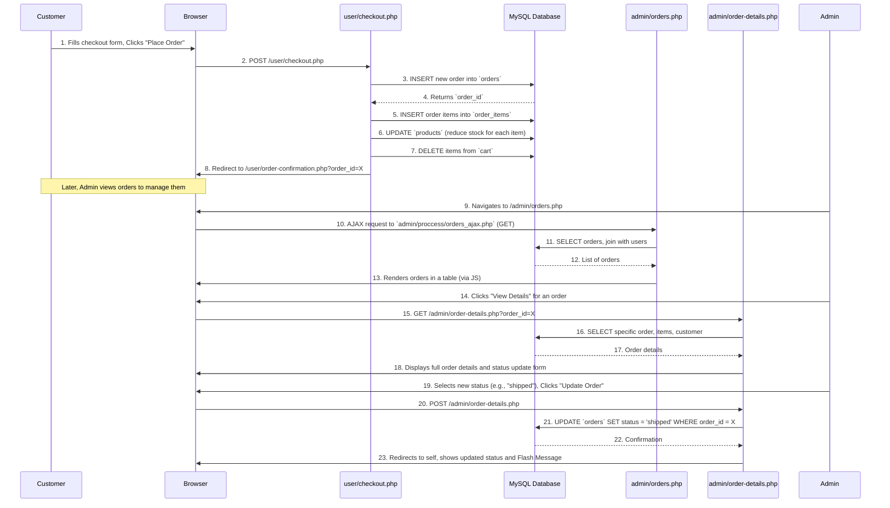

# Chapter 6: Order Processing Lifecycle

In [Chapter 5: Shopping Cart Logic](05_shopping_cart_logic_.md), we learned how customers can add products to their virtual shopping cart, adjust quantities, and get a total. That's like customers filling their baskets in a physical store. But once the basket is full, what happens next? How does the store actually process the sale, prepare the items, and ensure they reach the customer?

This is where the **Order Processing Lifecycle** comes in!

This system is like the control center for a package delivery service within our e-commerce store. It manages every step an order takes, from the moment a customer clicks "Place Order" to when the package safely arrives at their doorstep. It records new orders, keeps track of their progress (like `pending`, `processing`, `shipped`, `delivered`), and lets both customers and administrators see the current status and details of each order.

## Why Do We Need Order Processing?

Without proper order processing, an e-commerce store would be chaotic! You wouldn't know:
*   Which customer bought what.
*   Where to ship the products.
*   If the payment was successful.
*   Which orders are still waiting to be sent.
*   If products are actually being delivered.

This system brings structure to sales, ensuring that every purchase is managed efficiently and transparently.

## Key Concepts

Let's break down the main ideas behind managing orders.

### 1. An Order

At its core, an **order** is a record of a customer's purchase. It takes all the items a customer put in their [Shopping Cart](05_shopping_cart_logic_.md) and turns them into a permanent record of a sale.

An order includes:
*   **Customer ID:** Who placed the order.
*   **Order Date:** When it was placed.
*   **Total Amount:** The total cost, including shipping.
*   **Shipping Address:** Where to send the products.
*   **Payment Method:** How the customer paid (e.g., Cash on Delivery, Khalti).
*   **Order Status:** Its current stage in the delivery process.
*   **Order Items:** The specific products and quantities included in this order.

In our system, order information is stored in two main database tables ([Chapter 2: Database Connection & Operations](02_database_connection___operations_.md)):
*   `orders`: Stores overall order details (customer, total, status, address).
*   `order_items`: Stores the individual products bought within each order. This table links back to `orders` and `products`.

### 2. Order Statuses

An order doesn't just go from "placed" to "delivered" instantly. It moves through different stages, each represented by a **status**. This allows both customers and admins to track its journey.

| Status       | Description                                                       | Who changes it? |
| :----------- | :---------------------------------------------------------------- | :-------------- |
| `pending`    | The order has been placed but not yet confirmed or prepared.      | Admin           |
| `processing` | The store is preparing the items for shipment (picking, packing). | Admin           |
| `shipped`    | The order has left the warehouse and is on its way.               | Admin           |
| `delivered`  | The order has successfully reached the customer.                  | Admin           |
| `cancelled`  | The order was cancelled by either the customer or the admin.      | Admin/Customer  |

### 3. Roles in Order Processing

Both customers and administrators interact with the order processing system, but with different permissions:

*   **Customers (`user` role):** Can view their own order history, track the status of their orders, and see order details. They cannot change order statuses.
*   **Administrators (`admin` role):** Have full control. They can view all orders, update statuses, add notes, and mark payments as received. This is managed by [User Session & Access Control](03_user_session___access_control_.md).

## How to Place and Manage Orders

Let's follow an order through its lifecycle in our `ecommercePHP` project.

### 1. Placing an Order (Customer Action)

After a customer has filled their [Shopping Cart](05_shopping_cart_logic_.md) and confirmed their selection, they proceed to the checkout page (`user/checkout.php`). Here, they provide shipping details and choose a payment method.

**Location:** `user/checkout.php` handles displaying the form and processing the submission.

```php
<?php
// File: user/checkout.php (Simplified - POST request for order placement)
session_start();
require '../config/db.php'; 
// ... (flash messages, user data, cart details loading and stock check from Chapter 5) ...

// When the "Place Order" button is clicked
if ($_SERVER['REQUEST_METHOD'] == "POST"){
    $user_id = $_SESSION['user_id'];
    $shipping_fee = $totals['shipping_fee']; // from getTotals function
    $total = $totals['total'];             // from getTotals function
    $shipping_address = mysqli_real_escape_string($conn, $_POST['shipping_address']);
    $phone = mysqli_real_escape_string($conn, $_POST['phone']);
    $payment_method = mysqli_real_escape_string($conn, $_POST['payment_method']);
    $notes = mysqli_real_escape_string($conn, $_POST['notes']);

    // 1. Insert into orders table
    $insertOrderSQL = "INSERT INTO `orders`(`user_id`, `shipping_fee`, `total`, `status`, `shipping_address`, `phone`, `payment_method`, `payment_status`, `notes`) VALUES (
        '$user_id', '$shipping_fee', '$total', 'pending', '$shipping_address', '$phone', '$payment_method', 'pending', '$notes'
    )";
    $resultOrder = mysqli_query($conn, $insertOrderSQL);
    $order_id = mysqli_insert_id($conn); // Get the ID of the newly created order

    $allOrderItemsInserted = true;
    foreach ($cart_details as $cart_item) { // $cart_details comes from prior logic
        // 2. Insert into order_items table for each product in the cart
        $insertOrderItemsSQL = "INSERT INTO `order_items`(`order_id`, `product_id`, `quantity`, `order_price`, `sub_total`) 
            VALUES ( '$order_id', '{$cart_item['product_id']}', '{$cart_item['quantity']}', '{$cart_item['product_price']}', '{$cart_item['cart_total']}' )";
        $resultOrderItem = mysqli_query($conn, $insertOrderItemsSQL);
        if (!$resultOrderItem) $allOrderItemsInserted = false;

        // 3. Update product stock (Crucial step!)
        $updateProductStockSQL = "UPDATE `products` SET `stock` = `stock` - {$cart_item['quantity']} WHERE `product_id` = {$cart_item['product_id']}";
        mysqli_query($conn, $updateProductStockSQL); // Execute stock update
    }
    
    // 4. Delete the cart items (since they are now part of an order)
    $deleteCartSelected = "DELETE FROM `cart` WHERE `user_id` = $user_id $whereClause";
    $resultDeleteCart = mysqli_query($conn, $deleteCartSelected);
    
    if ($resultOrder && $allOrderItemsInserted && $resultDeleteCart) {
        $_SESSION['message-status'] = 'success';
        $_SESSION['message'] = "Order placed successfully!";
        header("Location: order-confirmation.php?order_id=$order_id"); // Redirect to confirmation
        exit();
    } else {
        $_SESSION['message-status'] = 'error';
        $_SESSION['message'] = "There was an error placing your order. Please try again.";
        header("Location: checkout.php"); // Redirect back to checkout
        exit();
    }
}
// ... rest of checkout.php HTML
?>
```

**Explanation:**
1.  **Collect Data:** The script gathers the customer's shipping address, phone, chosen payment method, and any notes from the form.
2.  **Insert Order:** It inserts a new row into the `orders` table with status `pending`. `mysqli_insert_id($conn)` is used to get the unique `order_id` that was just created.
3.  **Insert Order Items & Update Stock:** It then loops through each item in the customer's cart. For each item, it inserts a record into the `order_items` table (linking it to the new `order_id`) and **crucially updates the `products` table to reduce the `stock`** of that product.
4.  **Clear Cart:** After all items are successfully transferred to the order, the items are `DELETE`d from the `cart` table.
5.  **Feedback & Redirect:** A [Flash Message](01_flash_message_system_.md) confirms the order, and the customer is redirected to `user/order-confirmation.php`.

### 2. Viewing Order Confirmation (Customer View)

Immediately after placing an order, customers are taken to `user/order-confirmation.php` to see a summary of their new order.

**Location:** `user/order-confirmation.php`.

```php
<?php
// File: user/order-confirmation.php (Simplified)
session_start();
require '../config/db.php';

$user_id = $_SESSION['user_id'];
$order_id = $_GET['order_id']; // Get order ID from URL

// Fetch order details
$orderDetailQuery = "SELECT * FROM orders WHERE order_id = $order_id AND user_id = $user_id";
$orderDetailResult = mysqli_query($conn, $orderDetailQuery);

if (mysqli_num_rows($orderDetailResult) > 0) {
    $order = mysqli_fetch_assoc($orderDetailResult); // Main order data

    // Fetch order items
    $orderItemsDetailQuery = "SELECT * FROM order_details WHERE order_id = $order_id AND user_id = $user_id";
    $orderItemsDetailResult = mysqli_query($conn, $orderItemsDetailQuery);
    $order_items = [];
    while ($itemRow = mysqli_fetch_assoc($orderItemsDetailResult)) {
        $order_items[] = $itemRow;
    }
} else {
    // Handle error: order not found or doesn't belong to user
    $_SESSION['message-status'] = 'fail';
    $_SESSION['message'] = "Order not found or access denied.";
    header("Location: homepage.php");
    exit();
}
// ... HTML to display $order and $order_items ...
?>
```

**Explanation:**
*   This page takes the `order_id` from the URL parameter.
*   It performs `SELECT` queries on the `orders` and `order_details` tables (which is a view joining `order_items` with `products` to get product info) to retrieve all information about the order and its items.
*   The data is then displayed in a user-friendly format, confirming the purchase.

### 3. Tracking an Order (Customer View)

Customers can revisit their orders to check the current status at any time via `user/order-tracking.php`.

**Location:** `user/order-tracking.php`.

```php
<?php
// File: user/order-tracking.php (Simplified)
session_start();
require '../config/db.php';
// ... (check user session, flash messages) ...

$user_id = $_SESSION['user_id'];
$order_id = $_GET['order_id'];

// Similar to confirmation, fetch order and order items
$orderDetailQuery = "SELECT * FROM orders WHERE order_id = $order_id AND user_id = $user_id";
$orderDetailResult = mysqli_query($conn, $orderDetailQuery);
$order = mysqli_fetch_assoc($orderDetailResult);

$orderItemsDetailQuery = "SELECT * FROM order_details WHERE order_id = $order_id AND user_id = $user_id";
$orderItemsDetailResult = mysqli_query($conn, $orderItemsDetailQuery);
$order_items = [];
while ($itemRow = mysqli_fetch_assoc($orderItemsDetailResult)) {
    $order_items[] = $itemRow;
}

// ... HTML to display order details and a visual progress bar based on $order['status'] ...
// The progress bar visually indicates the order's stage (pending, processing, shipped, delivered)
?>
```

**Explanation:**
*   This page retrieves order details just like the confirmation page.
*   It then uses the `order['status']` value to highlight the current stage in a visual timeline, clearly showing the customer how far along their order is.

### 4. Viewing All Orders (Admin View)

Administrators need an overview of all orders to manage them. This is available on `admin/orders.php`.

**Location:** `admin/orders.php` (front-end display) and `admin/proccess/orders_ajax.php` (backend data fetching).

The `admin/orders.php` page uses JavaScript to fetch a list of orders dynamically from `admin/proccess/orders_ajax.php`. This allows for searching and filtering without full page reloads.

```php
<?php
// File: admin/proccess/orders_ajax.php (Simplified GET request for listing orders)
require_once '../../config/db.php';
header('Content-Type: application/json'); // Tell browser to expect JSON

if ($_SERVER['REQUEST_METHOD'] === 'GET') {
    $search = isset($_GET['search']) ? trim($_GET['search']) : '';
    $status = isset($_GET['status']) ? $_GET['status'] : '';

    $sql = "SELECT o.*, u.username, u.email FROM orders o JOIN users u ON o.user_id = u.user_id";
    $where = [];
    $params = [];
    $types = '';

    // Build WHERE clause based on search and status filters
    if ($search !== '') {
        $where[] = "(o.order_id LIKE ? OR u.username LIKE ? OR u.email LIKE ?)";
        $search_param = "%$search%";
        $params[] = &$search_param;
        $params[] = &$search_param;
        $params[] = &$search_param;
        $types .= 'sss';
    }
    if ($status !== '' && in_array($status, ['pending','processing','shipped','delivered','cancelled'])) {
        $where[] = "o.status = ?";
        $params[] = &$status;
        $types .= 's';
    }

    if ($where) $sql .= " WHERE " . implode(' AND ', $where);
    $sql .= " ORDER BY o.created_at DESC";

    // Use prepared statements for safety (as learned in Chapter 2)
    $stmt = $conn->prepare($sql);
    if ($params) {
        array_unshift($params, $types);
        call_user_func_array([$stmt, 'bind_param'], $params);
    }
    $stmt->execute();
    $result = $stmt->get_result();
    
    $orders = [];
    while ($row = $result->fetch_assoc()) $orders[] = $row;
    
    $stmt->close();
    echo json_encode(['success' => true, 'orders' => $orders]); // Send orders as JSON
    exit;
}
// ... (POST request for updating status is below) ...
?>
```

**Explanation:**
*   The script uses `SELECT` queries to fetch data from the `orders` table, joining it with the `users` table to get customer names and emails.
*   It includes logic to build dynamic `WHERE` clauses based on `search` text and `status` filters provided by the admin.
*   **Prepared statements** are used to ensure the query is secure from [SQL Injection](02_database_connection___operations_.md).
*   The results are packaged into a JSON format and sent back to the browser, where JavaScript on `admin/orders.php` renders them into an interactive table.

### 5. Viewing and Updating Single Order Details (Admin Action)

From the `admin/orders.php` list, an admin can click "View Details" to go to `admin/order-details.php` for a specific order. Here, they can see comprehensive details and also change the order's status.

**Location:** `admin/order-details.php` (display and form submission for status update).

```php
<?php
// File: admin/order-details.php (Simplified - POST request for updating status)
session_start();
require '../config/db.php';
$order_id = $_GET['order_id']; // Order ID from URL
// ... (fetch all order, customer, and order items details for display) ...

if($_SERVER['REQUEST_METHOD'] == "POST" && isset($_POST['update_status'])){
    $new_status = $_POST['new_status'];
    $admin_notes = $_POST['admin_notes'] ?? '';
    
    // Logic for payment status update, e.g., if COD and delivered, mark as paid.
    $payment_status = ($new_status == "delivered" && $order['payment_method'] == "cod") ? "paid" : "pending";
    
    // Update order status and notes in the database
    $sql = "UPDATE orders SET status = '$new_status', payment_status = '$payment_status', admin_notes = '$admin_notes', updated_at = NOW() WHERE order_id = '$order_id'";
    
    if(mysqli_query($conn, $sql)){
        $_SESSION['message-status'] = "success";
        $_SESSION['message'] = "Order Updated";
        header ("Location: ".$_SERVER['PHP_SELF']."?order_id=$order_id"); // Redirect to self
        exit();
    } else {
        $_SESSION['message-status'] = "fail";
        $_SESSION['message'] = "Failed to update order.";
        header ("Location: ".$_SERVER['PHP_SELF']."?order_id=$order_id");
        exit();
    }
}
// ... HTML to display order details, customer info, shipping address, and the status update form ...
?>
```

**Explanation:**
*   The page first fetches and displays all relevant order data using `SELECT` queries based on the `order_id` (similar to customer views, but with more admin-specific details).
*   When the admin submits the "Update Order Status" form, the script captures `new_status` and `admin_notes`.
*   An `UPDATE` SQL query is executed to change the `status`, `payment_status`, and `admin_notes` columns for the specific `order_id` in the `orders` table.
*   A [Flash Message](01_flash_message_system_.md) provides feedback, and the page reloads to show the updated status.

There's also an AJAX endpoint (`admin/proccess/orders_ajax.php`) that allows admins to quickly change an order's status directly from the main orders list without needing to navigate to the detailed page.

```php
<?php
// File: admin/proccess/orders_ajax.php (Simplified POST request for updating status)
require_once '../../config/db.php';
header('Content-Type: application/json');

// Update order status via AJAX
if ($_SERVER['REQUEST_METHOD'] === 'POST' && isset($_POST['order_id'], $_POST['new_status'])) {
    $order_id = intval($_POST['order_id']); // Ensure it's an integer
    $new_status = $_POST['new_status'];
    
    // Validate status input
    $allowed_statuses = ['pending', 'processing', 'shipped', 'delivered', 'cancelled'];
    if (!in_array($new_status, $allowed_statuses)) {
        echo json_encode(['success' => false, 'message' => 'Invalid status']);
        exit;
    }

    // Use prepared statement for safety
    $stmt = $conn->prepare("UPDATE orders SET status = ?, updated_at = NOW() WHERE order_id = ?");
    $stmt->bind_param('si', $new_status, $order_id);
    $success = $stmt->execute();
    $stmt->close();
    
    echo json_encode(['success' => $success]); // Respond with success/fail
    exit;
}
// ... (GET request for listing orders is above) ...
?>
```

**Explanation:**
*   This code snippet is part of the `orders_ajax.php` file and is triggered by an AJAX `POST` request.
*   It takes the `order_id` and `new_status`.
*   A **prepared statement** `UPDATE`s the `status` and `updated_at` fields in the `orders` table.
*   It returns a simple JSON response indicating `success` or `failure`, which the JavaScript on `admin/orders.php` uses to update the display.

## How the Order Processing Lifecycle Works Internally

Let's visualize a simple journey from a customer placing an order to an admin updating its status.



1.  **Customer Places Order:** The customer submits the checkout form.
2.  **Order Creation (Backend):** The `user/checkout.php` script on the server:
    *   Creates a new record in the `orders` table.
    *   Adds each product from the cart to the `order_items` table, linked to the new order.
    *   **Decreases the `stock` count** for each purchased product in the `products` table. This is critical for [Product & Inventory Management](04_product___inventory_management_.md).
    *   Removes the purchased items from the `cart` table.
    *   Redirects the customer to a confirmation page.
3.  **Admin Views Orders:** An administrator visits `admin/orders.php`. This page uses an AJAX call to `admin/proccess/orders_ajax.php` to fetch a list of all orders from the database, which are then displayed in a searchable table.
4.  **Admin Updates Order:** The admin clicks on an order to view its `admin/order-details.php` page. Here, they can manually change the order's status (e.g., from `pending` to `processing`, then to `shipped`, then `delivered`). When they submit the update, the `admin/order-details.php` script executes an `UPDATE` query on the `orders` table in the database to reflect the new status.

## Conclusion

The Order Processing Lifecycle is the engine of our e-commerce store, transforming customer selections into managed sales. By understanding how orders are created, tracked through various statuses, and managed by both customers and administrators, you've grasped the core flow of transactions in an online shop. This system ensures every purchase is accounted for, fulfilled, and delivered, providing transparency and efficiency.

Now that we know how to process an order, the next crucial step is understanding how to integrate real-world payment systems to complete those transactions.

[Next Chapter: Khalti Payment Gateway Integration](07_khalti_payment_gateway_integration_.md)

---

<sub><sup>**References**: [[1]](https://github.com/Aatish250/ecommercePHP/blob/d76d2c3a68acff6cef47eb78bc43f653c53f1142/user/checkout.php), [[2]](https://github.com/Aatish250/ecommercePHP/blob/d76d2c3a68acff6cef47eb78bc43f653c53f1142/user/khalti-callback.php), [[3]](https://github.com/Aatish250/ecommercePHP/blob/d76d2c3a68acff6cef47eb78bc43f653c53f1142/user/khalti-payment.php), [[4]](https://github.com/Aatish250/ecommercePHP/blob/d76d2c3a68acff6cef47eb78bc43f653c53f1142/vendor/xentixar/khalti-sdk/README.md), [[5]](https://github.com/Aatish250/ecommercePHP/blob/d76d2c3a68acff6cef47eb78bc43f653c53f1142/vendor/xentixar/khalti-sdk/src/Khalti.php)</sup></sub>