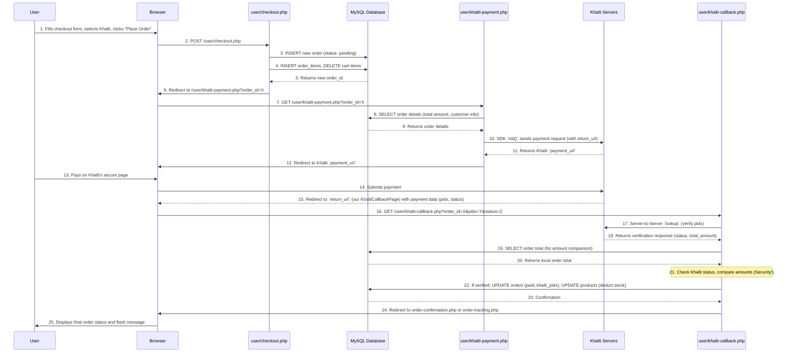

# Chapter 7: Khalti Payment Gateway Integration

In [Chapter 6: Order Processing Lifecycle](06_order_processing_lifecycle_.md), we learned how our e-commerce store creates a permanent record of a customer's purchase, tracks its status, and updates inventory. That's like the store manager organizing all the new sales in their office. But what about the money? How does the customer actually *pay* for the items in their order?

This is where **Khalti Payment Gateway Integration** comes in!

Imagine you've filled your shopping cart and are ready to pay. Instead of handing over cash or swiping a card directly to our website, a **Payment Gateway** is like a secure digital cashier. When you choose Khalti, our website hands your payment details over to Khalti, which securely handles the transaction. Khalti collects the money from your digital wallet and then, once the payment is confirmed, tells our website, "Hey, this payment was successful!" Our website then updates your order to "Paid."

This system acts like a dedicated financial assistant: it takes care of collecting payment details, securely talks to the Khalti platform to start and check transactions, then gets feedback from Khalti (a "callback") to confirm if a payment was successful, failed, or canceled. Based on this feedback, it updates your order's status accordingly.

## Why Do We Need a Payment Gateway?

Directly handling online payments involves complex security, bank integrations, and regulatory compliance. A payment gateway like Khalti simplifies all of this by:
*   **Security:** Handling sensitive financial information securely, so our website doesn't have to.
*   **Convenience:** Offering users a popular, easy way to pay digitally.
*   **Trust:** Building confidence in customers that their money is handled professionally.
*   **Automation:** Automatically updating order and payment statuses based on Khalti's feedback.

Without a payment gateway, our e-commerce store wouldn't be able to accept digital payments, limiting customers to options like Cash on Delivery.

## Key Concepts

Let's break down the main ideas behind integrating a payment gateway.

### 1. What is Khalti?

Khalti is a popular digital wallet and payment gateway in Nepal. It allows users to make payments online using their Khalti account, linked bank accounts, or mobile banking. For developers, Khalti provides an **API** (Application Programming Interface) and SDKs (Software Development Kits) that make it easy to integrate their payment system into a website or app.

### 2. API Keys (Secret Key)

To talk to the Khalti platform, our website needs a special "key" to prove its identity and authorize transactions. This is called the **Secret Key**. It's like a password for our application to access Khalti's services. This key *must* be kept secret and never exposed in client-side code (like JavaScript).

### 3. Payment Initiation

This is the first step where our website tells Khalti, "Hey, I have a customer who wants to pay X amount for Order Y." Our website sends the order details (amount, order ID, customer info) to Khalti. Khalti then responds with a special `payment_url`. Our website then redirects the customer's browser to this `payment_url`, taking them to Khalti's secure payment page to complete the transaction.

### 4. Callback URL (Feedback)

After the customer completes (or cancels) their payment on Khalti's page, Khalti needs to tell *our* website what happened. It does this by redirecting the customer's browser back to a specific URL on our website called the **Callback URL**. This URL includes important details in its query parameters (like `pidx`, `status`, `amount`), telling our server if the payment was a success, failure, or cancellation.

### 5. Transaction Verification (Server-to-Server Handshake)

Even if Khalti redirects the user back to our callback URL with a "success" status, we cannot *fully* trust this browser-based redirect. For maximum security, our server then performs a **server-to-server verification** (often called a "lookup") with Khalti's API. This is like our server secretly calling Khalti and asking, "Did this payment *really* go through for this amount and order ID?" Only after Khalti's API confirms it directly to our server do we update the order as genuinely "paid." This prevents fake "success" messages.

## How to Integrate Khalti Payment Gateway

Let's walk through the steps a customer takes to pay with Khalti and how our system handles it.

### Step 1: Choosing Khalti at Checkout (`user/checkout.php`)

On the checkout page, the customer can choose their preferred payment method.

```php
<?php
// File: user/checkout.php (Simplified - Payment Method HTML)
// ... other HTML ...
?>
<div class="mb-6">
    <h3 class="text-lg font-medium text-gray-800 mb-4">Payment Method</h3>
    <div class="space-y-4">
        <!-- Cash on Delivery -->
        <div class="border rounded-lg p-4">
            <label class="flex items-center cursor-pointer">
                <input type="radio" name="payment_method" value="cod" checked
                    class="h-4 w-4 text-indigo-600 focus:ring-indigo-500 border-gray-300">
                <span class="ml-3 text-sm font-medium text-gray-900">Cash on Delivery</span>
            </label>
        </div>

        <!-- Khalti Payment -->
        <div class="border rounded-lg p-4">
            <label class="flex items-center cursor-pointer">
                <input type="radio" name="payment_method" value="khalti"
                    class="h-4 w-4 text-indigo-600 focus:ring-indigo-500 border-gray-300">
                <span class="ml-3 text-sm font-medium text-gray-900">Khalti Digital Wallet</span>
            </label>
        </div>
    </div>
</div>
<?php
// ... rest of checkout.php HTML
?>
```
**Explanation:**
*   This is part of the HTML form on `user/checkout.php`.
*   The `input type="radio"` elements allow the user to select either "Cash on Delivery" (`cod`) or "Khalti Digital Wallet" (`khalti`). The `name="payment_method"` ensures only one can be selected.

When the customer clicks "Place Order" and has selected "Khalti," the PHP code in `user/checkout.php` needs to act differently. This code also needs to process the order (create entries in `orders` and `order_items` tables) *before* redirecting to Khalti. Stock deduction happens *after* successful Khalti verification, not at this stage.

```php
<?php
// File: user/checkout.php (Simplified - Redirect to Khalti logic after order creation)
session_start();
require '../config/db.php';
// ... (previous code for user session, cart details, stock check, etc.) ...

if ($_SERVER['REQUEST_METHOD'] == "POST"){
    // ... (code to insert order into `orders` table and get $order_id) ...
    // ... (code to insert items into `order_items` table, but NOT deduct stock yet for Khalti) ...
    // ... (code to delete items from `cart` table) ...

    if ($resultOrder && $allOrderItemsInserted && $resultDeleteCart) { // If basic order creation successful
        if ($_POST['payment_method'] === 'khalti') {
            // If Khalti is selected, redirect to our Khalti payment initiation page
            header("Location: khalti-payment.php?order_id=$order_id");
            exit();
        } else {
            // For COD, deduct stock immediately and redirect to confirmation
            // (This stock deduction logic is moved here for COD for simplicity based on provided code)
            foreach ($cart_details as $cart_item) {
                $updateProductStockSQL = "UPDATE `products` SET `stock` = `stock` - {$cart_item['quantity']} WHERE `product_id` = {$cart_item['product_id']}";
                mysqli_query($conn, $updateProductStockSQL);
            }
            header("Location: order-confirmation.php?order_id=$order_id");
            exit();
        }
    } else {
        // ... (handle error and set flash message) ...
    }
}
// ... rest of checkout.php
?>
```
**Explanation:**
*   After the order is successfully created in our database (but *before* deducting stock for Khalti payments!), the script checks the chosen `payment_method`.
*   If `khalti` is chosen, the customer is redirected to `user/khalti-payment.php`, passing the `order_id` in the URL. This new page will handle the actual communication with Khalti.
*   If `cod` (Cash on Delivery) is chosen, stock is deducted immediately, and the user goes to the `order-confirmation.php` page.

### Step 2: Initiating Payment with Khalti SDK (`user/khalti-payment.php`)

This file is responsible for preparing the payment details and sending them to Khalti, which then redirects the user to Khalti's payment page.

```php
<?php
// File: user/khalti-payment.php (Simplified)
require_once __DIR__ . '/../vendor/autoload.php'; // Load Khalti SDK
require_once __DIR__ . '/../config/db.php'; // Database connection
use Xentixar\KhaltiSdk\Khalti;

// 1. Get order_id from the URL
$order_id = intval($_GET['order_id']); 

// 2. Fetch order details from our database
$getOrderSQL = "SELECT o.total, u.username, u.email, u.phone 
                FROM orders o JOIN users u ON o.user_id = u.user_id
                WHERE o.order_id = $order_id";
$resultOrder = mysqli_query($conn, $getOrderSQL);
$order_details = mysqli_fetch_assoc($resultOrder);

// 3. Prepare payment data for Khalti
$amountInPaisa = $order_details['total']; // Amount in Rupees for our DB
$purchaseOrderId = $order_details['order_id'];
$customerInfo = [
    "name" => $order_details['username'],
    "email" => $order_details['email'],
    "phone" => $order_details['phone']
];

// 4. Initialize Khalti SDK and set Secret Key
$khalti = new Khalti();
$khalti->setSecretKey('c0086a41a71c499b91ffa67336cd9045'); // Use your actual Secret Key!

// 5. Dynamically build return and website URLs
$scheme = isset($_SERVER['HTTPS']) && $_SERVER['HTTPS'] === 'on' ? 'https' : 'http';
$host = $_SERVER['HTTP_HOST'];
$base_app_folder = '/'.basename(dirname(__DIR__)); 
$dynamic_website_base_url = $scheme . '://' . $host . $base_app_folder;
$returnUrl = $dynamic_website_base_url . '/user/khalti-callback.php?order_id=' . $order_id;

// 6. Configure Khalti with payment details and initiate
$khalti->config(
    $returnUrl,
    $dynamic_website_base_url,
    $amountInPaisa, // Khalti SDK internally converts this to paisa (*100)
    $purchaseOrderId,
    "Order #" . $order_id,
    $customerInfo
);
$khalti->init(); // This will redirect the user to Khalti's payment page
?>
```
**Explanation:**
*   `require_once __DIR__ . '/../vendor/autoload.php';`: This line is crucial! It loads the Khalti SDK library we installed via Composer, making the `Khalti` class available.
*   The script first gets the `order_id` from the URL.
*   It then queries our database ([Chapter 2: Database Connection & Operations](02_database_connection___operations_.md)) to retrieve the order's `total` amount and the customer's `username`, `email`, and `phone` using the `order_id`.
*   A `Khalti` object is created, and the `setSecretKey()` method is used to provide our secret key.
*   The `amountInPaisa` here represents the total in Rupees from our database. The Khalti SDK's `config` method takes this amount and *multiplies it by 100* to convert it to paisa before sending it to the Khalti API. So, if your order total is `10` (Rupees), the SDK will send `1000` (paisa) to Khalti.
*   `$returnUrl` is set to `user/khalti-callback.php`, including the `order_id` so our callback script knows which order to update.
*   `$khalti->init()`: This is the magic line! It sends the payment request to Khalti. If successful, Khalti responds with a `payment_url`, and the SDK automatically redirects the user's browser to that URL.

### Step 3: Customer Pays on Khalti's Website

*   After being redirected, the customer sees the Khalti payment page.
*   They log into their Khalti account, choose their payment source (wallet balance, linked bank), and confirm the payment.
*   Once they complete the payment, Khalti redirects their browser back to our `returnUrl` (`user/khalti-callback.php`), including payment status and details in the URL.

### Step 4: Handling Khalti Callback and Verification (`user/khalti-callback.php`)

This is the most critical part for security and updating our order status. This file receives the user back from Khalti and verifies the payment.

```php
<?php
// File: user/khalti-callback.php (Simplified)
session_start();
require_once __DIR__ . '/../config/db.php';

$khalti_secret_key = 'c0086a41a71c499b91ffa67336cd9045'; // Your Secret Key
$order_id = isset($_GET['order_id']) ? intval($_GET['order_id']) : null;
$pidx = isset($_GET['pidx']) ? $_GET['pidx'] : null; // Khalti's transaction ID

// Function to put stock back if payment fails/cancels after initial order creation
function addStockBack($conn, $orderId) { /* ... (see full code) ... */ }

// --- Part A: Handle user cancellation or early failure from Khalti ---
if ((isset($_GET['status']) && $_GET['status'] === 'Cancelled') || !$pidx) {
    if ($order_id) {
        // Update order status to cancelled in DB
        $update_order_sql = "UPDATE `orders` SET `status` = 'cancelled', `payment_status` = 'failed' WHERE `order_id` = '$order_id'";
        mysqli_query($conn, $update_order_sql);
        $_SESSION['message-status'] = 'error';
        $_SESSION['message'] = "Your payment was cancelled or failed.";
        header("Location: order-tracking.php?order_id=$order_id");
        exit();
    }
}

// --- Part B: Verify actual payment with Khalti's API (Server-to-Server) ---
if ($pidx && $order_id) {
    // 1. Send server-to-server request to Khalti to verify the transaction
    $curl = curl_init();
    curl_setopt_array($curl, array(
        CURLOPT_URL => 'https://dev.khalti.com/api/v2/epayment/lookup/', // Khalti API endpoint
        CURLOPT_RETURNTRANSFER => true,
        CURLOPT_CUSTOMREQUEST => 'POST',
        CURLOPT_POSTFIELDS => json_encode(['pidx' => $pidx]),
        CURLOPT_HTTPHEADER => array('Authorization: key ' . $khalti_secret_key, 'Content-Type: application/json'),
    ));
    $response = curl_exec($curl);
    $http_status = curl_getinfo($curl, CURLINFO_HTTP_CODE);
    curl_close($curl);
    $verification_data = json_decode($response, true);

    // 2. Check Khalti's API response
    if ($http_status === 200 && isset($verification_data['status']) && $verification_data['status'] === 'Completed') {
        // 3. Compare amounts: Khalti's amount vs. our database order total
        $get_order_total_sql = "SELECT total FROM orders WHERE order_id = '$order_id'";
        $local_order_total_row = mysqli_fetch_assoc(mysqli_query($conn, $get_order_total_sql));
        $local_order_total_in_paisa = floatval($local_order_total_row['total']); // Our DB stores in Rupees
        $khalti_amount_in_paisa = $verification_data['total_amount'] / 100; // Khalti returns in paisa, convert to Rupee

        if ($khalti_amount_in_paisa == $local_order_total_in_paisa) {
            // 4. Amount match! Update order status to paid and deduct stock
            $update_order_sql = "UPDATE `orders` SET `payment_status` = 'paid', `payment_method` = 'khalti', 
                                 `khalti_pidx` = '$pidx', `status` = 'pending' WHERE `order_id` = '$order_id'";
            mysqli_query($conn, $update_order_sql);

            // Deduct stock for each item in the order (only on successful payment)
            $get_order_items_sql = "SELECT product_id, quantity FROM order_items WHERE order_id = '$order_id'";
            $order_items_result = mysqli_query($conn, $get_order_items_sql);
            while ($item = mysqli_fetch_assoc($order_items_result)) {
                $update_stock_sql = "UPDATE `products` SET `stock` = `stock` - {$item['quantity']} WHERE `product_id` = {$item['product_id']}";
                mysqli_query($conn, $update_stock_sql);
            }

            $_SESSION['message-status'] = 'success';
            $_SESSION['message'] = "Payment successful! Your order is now processing.";
            header("Location: order-confirmation.php?order_id=$order_id");
            exit();
        } else {
            // Amount mismatch - Critical security error
            $_SESSION['message-status'] = 'error';
            $_SESSION['message'] = "Payment amount mismatch! Order not confirmed.";
            // Update order to 'failed/cancelled' in DB and log error
            // addStockBack($conn, $order_id); // Not needed as stock was not deducted initially.
            header("Location: order-tracking.php?order_id=$order_id");
            exit();
        }
    } else {
        // Khalti API verification failed or payment not 'Completed'
        $_SESSION['message-status'] = 'error';
        $_SESSION['message'] = "Payment verification failed. Please try again or choose COD.";
        // Update order to 'failed/cancelled' in DB and log error
        // addStockBack($conn, $order_id); // Not needed
        header("Location: order-tracking.php?order_id=$order_id");
        exit();
    }
} else {
    // Missing pidx or order_id
    $_SESSION['message-status'] = 'error';
    $_SESSION['message'] = "Invalid payment callback.";
    header("Location: homepage.php");
    exit();
}
?>
```
**Explanation:**
*   This script runs when Khalti redirects the user back to our website. It receives `order_id` and `pidx` (Khalti's Transaction ID) as `GET` parameters.
*   **Part A (Cancellation/Early Failure):** It first checks if Khalti reported a "Cancelled" status or if `pidx` is missing. In these cases, it immediately marks the order as `cancelled` and `failed` in our database. Importantly, **stock is NOT added back here** because it was never deducted in the first place for Khalti payments (stock deduction happens *only* on full verification).
*   **Part B (Verification):** If `pidx` exists, it initiates a **server-to-server request** to Khalti's `lookup` API using `curl`. This is the secure handshake to verify the payment.
*   **Response Check:** It checks if Khalti's API responds with an `HTTP 200 OK` status and confirms the `status` is `Completed`.
*   **Amount Comparison:** **Crucially**, it fetches the `total` amount from our `orders` table and compares it with the `total_amount` returned by Khalti's API. This is a vital security step to prevent tampering. Khalti's API often returns amounts in "paisa" (100 paisa = 1 Rupee), so we divide by 100 to convert to Rupees for comparison with our database.
*   **Order Update & Stock Deduction:** If both the status is `Completed` and the amounts match, then and *only then* is the order updated in our database to `payment_status = 'paid'`, and the `status` set to `pending` (ready for admin processing). This is also the point where **product stock is finally deducted** from our `products` table ([Chapter 4: Product & Inventory Management](04_product___inventory_management_.md)).
*   **Error Handling:** If verification fails or amounts don't match, the order status is updated to `failed` or `cancelled`, and appropriate [Flash Messages](01_flash_message_system_.md) are set.
*   Finally, the user is redirected to `order-confirmation.php` or `order-tracking.php` to see their updated order status.

## How the Khalti Payment Integration Works Internally

Let's visualize the journey of a customer paying with Khalti.



1.  **Customer Initiates Order:** The user fills the checkout form, selects Khalti, and clicks "Place Order" on `user/checkout.php`.
2.  **Order Creation on Our Server:** The `user/checkout.php` script creates a new `order` record in our **MySQL Database** with a `pending` status. It also adds `order_items` and clears the `cart`. Importantly, it *does not* deduct stock yet. It then redirects the user to `user/khalti-payment.php`.
3.  **Khalti Payment Initiation:** The `user/khalti-payment.php` script fetches the order details (like total amount) from our **MySQL Database**. It then uses the Khalti SDK to send an initiation request to **Khalti Servers**, providing details and a `return_url` (our `user/khalti-callback.php`). Khalti responds with a payment URL, and our script immediately redirects the **Browser** to that URL.
4.  **Payment on Khalti's Site:** The **User** interacts with Khalti's secure payment page in their **Browser** to complete the transaction.
5.  **Khalti Callback:** After payment, **Khalti Servers** redirect the **Browser** back to our specified `return_url` (`user/khalti-callback.php`), including transaction details like `pidx` and `status` in the URL.
6.  **Payment Verification on Our Server:** The `user/khalti-callback.php` script (running on our server):
    *   Receives the callback.
    *   **Performs a crucial server-to-server verification** by sending a `lookup` request directly to **Khalti Servers** using the `pidx`. This confirms the transaction without relying on the browser.
    *   Fetches the order's total amount from our **MySQL Database** for that `order_id`.
    *   Compares Khalti's reported payment amount with our database's expected amount to prevent fraud.
    *   If everything matches and Khalti confirms "Completed":
        *   It updates the order status in our **MySQL Database** to `paid` and `pending` (for fulfillment) and stores Khalti's transaction IDs.
        *   **It finally deducts the product stock** from the `products` table in our **MySQL Database**.
    *   If there's a cancellation, failure, or verification mismatch, it updates the order status accordingly (e.g., `cancelled`, `failed`) and sets a [Flash Message](01_flash_message_system_.md).
7.  **Final Redirection:** The `user/khalti-callback.php` script then redirects the **Browser** to either the `order-confirmation.php` or `order-tracking.php` page, showing the user the final status of their order and any relevant [Flash Messages](01_flash_message_system_.md).

## Conclusion

Khalti Payment Gateway Integration is a vital component for enabling modern e-commerce transactions. By understanding the flow from payment initiation to secure server-to-server verification and handling callbacks, you've learned how to securely process digital payments. This system ensures that your store can accept payments reliably, update order statuses accurately, and maintain correct inventory levels, bringing your online store to full functionality.

This chapter concludes our tutorial series on the `ecommercePHP` project. You've now built a robust foundation, from displaying products and managing user sessions to processing complex orders and integrating external payment systems!

---

<sub><sup>**References**: [[1]](https://github.com/Aatish250/ecommercePHP/blob/d76d2c3a68acff6cef47eb78bc43f653c53f1142/user/checkout.php), [[2]](https://github.com/Aatish250/ecommercePHP/blob/d76d2c3a68acff6cef47eb78bc43f653c53f1142/user/khalti-callback.php), [[3]](https://github.com/Aatish250/ecommercePHP/blob/d76d2c3a68acff6cef47eb78bc43f653c53f1142/user/khalti-payment.php), [[4]](https://github.com/Aatish250/ecommercePHP/blob/d76d2c3a68acff6cef47eb78bc43f653c53f1142/vendor/xentixar/khalti-sdk/README.md), [[5]](https://github.com/Aatish250/ecommercePHP/blob/d76d2c3a68acff6cef47eb78bc43f653c53f1142/vendor/xentixar/khalti-sdk/src/Khalti.php)</sup></sub>