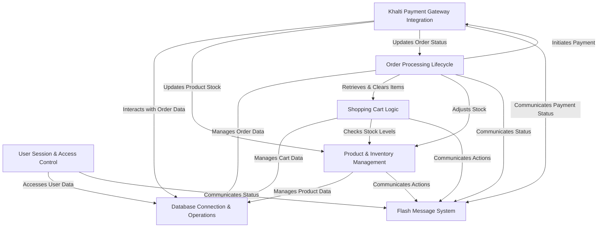

<a href="../README.md" style="display: inline-block; padding: 5px 10px; background-color: #22272e; color: #adbac7; border-radius: 6px; text-decoration: none; font-weight: 600; margin-top: 10px; border: 1px solid #373e47; box-shadow: 0 1px 0 #373e47;">Go Back to README</a>
# Tutorial: ecommercePHP

The `ecommercePHP` project is a comprehensive **e-commerce platform** designed for both customers and administrators. It allows users to browse *products*, add items to a *shopping cart*, and place *orders*. Payments can be processed securely through the **Khalti digital wallet** integration, and administrators have tools to manage *product inventory*, track *sales*, and update *order statuses*.

## Visual Overview

## Chapters

1. [Flash Message System
](01_flash_message_system_.md)
2. [Database Connection & Operations
](02_database_connection___operations_.md)
3. [User Session & Access Control
](03_user_session___access_control_.md)
4. [Product & Inventory Management
](04_product___inventory_management_.md)
5. [Shopping Cart Logic
](05_shopping_cart_logic_.md)
6. [Order Processing Lifecycle
](06_order_processing_lifecycle_.md)
7. [Khalti Payment Gateway Integration
](07_khalti_payment_gateway_integration_.md)
