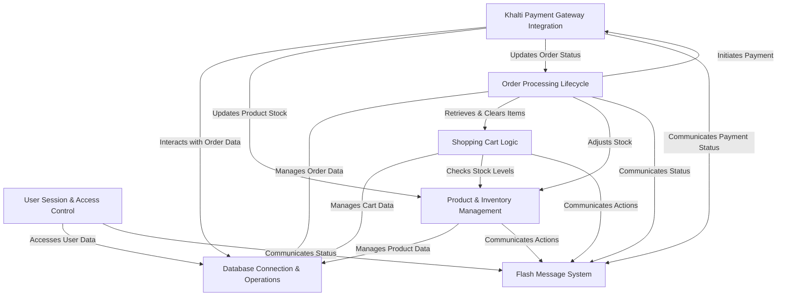

# E-Commerce Web Application

This project `ecommercePHP` project is a comprehensive **e-commerce platform** designed for both customers and administrators. It allows users to browse *products*, add items to a *shopping cart*, and place *orders*. Payments can be processed securely through the **Khalti digital wallet** integration, and administrators have tools to manage *product inventory*, track *sales*, and update *order statuses*.


## Visual Overview



## Chapters

1. [Flash Message System
](Detail%20Md/01_flash_message_system_.md)
2. [Database Connection & Operations
](Detail%20Md/02_database_connection___operations_.md)
3. [User Session & Access Control
](Detail%20Md/03_user_session___access_control_.md)
4. [Product & Inventory Management
](Detail%20Md/04_product___inventory_management_.md)
5. [Shopping Cart Logic
](Detail%20Md/05_shopping_cart_logic_.md)
6. [Order Processing Lifecycle
](Detail%20Md/06_order_processing_lifecycle_.md)
7. [Khalti Payment Gateway Integration
](Detail%20Md/07_khalti_payment_gateway_integration_.md)

## Features

- User registration and login
- Product listing and details
- Shopping cart
- Order placement and order history
- Admin dashboard for managing products and orders
- Khalti Payment Gateway (KPG) integrated

## Getting Started

1. **Clone the repository:**
   ```
   git clone https://github.com/yourusername/ecommerce-app.git
   ```

2. **Import the database:**
   - Import the SQL file located at `db/ecom_db.sql` into your MySQL server.

3. **Configure the application:**
   - Update database credentials in `config/db.php`.

4. **Run the application:**
   - Open `ecommercePHP/` in your browser.

5. **Create Admin Account:**
<br>By default no admin account are created. To create a admin account follow the steps below:
   - Open `create_admin.php` via direct URL
   - Fill the provided form and submit.
<br>
## Directory Overview
.
├── README.md
├── change_password.php
├── create_admin.php
├── index.php
├── components
│   ├── admin_nav.php
│   ├── flashMessage.php
│   ├── link_imports.php
│   ├── show_flash_message.php
│   └── user_nav.php
├── config
│   ├── db.php
│   └── verify_session.php
├── db
│   └── ecom_db.sql
├── img
│   ├── logo
│   └── product
├── src
│   ├── input.css
│   └── output.css
├── user
│   ├── cart.php
│   ├── checkout.php
│   ├── edit-profile.php
│   ├── homepage.php
│   ├── khalti-callback.php
│   ├── khalti-payment.php
│   ├── order-confirmation.php
│   ├── order-tracking.php
│   ├── proccess
│   │   ├── cart_table.php
│   │   └── home_products.php
│   ├── product_detail.php
│   └── profile.php
├── admin
│   ├── dashboard.php
│   ├── inventory.php
│   ├── order-details.php
│   ├── orders.php
│   ├── proccess
│   │   ├── add_product.php
│   │   ├── inventory_products.php
│   │   └── orders_ajax.php
│   ├── sales.php
│   ├── user-profile.php
│   └── users.php
├── composer.json
├── composer.lock
├── node_modules
├── package-lock.json
├── package.json
└── vendor