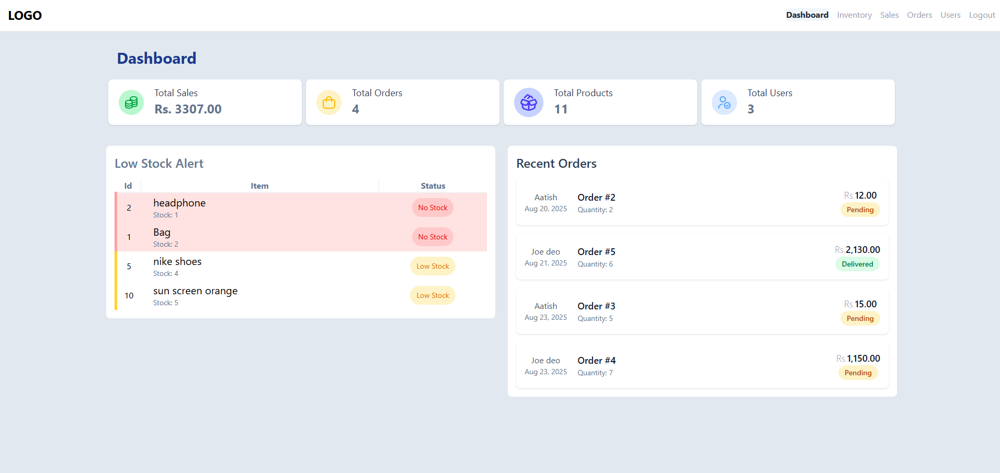

# 🛒 E-Commerce Web Application

This project `ecommercePHP` is a comprehensive **e-commerce platform** designed for both customers and administrators. It allows users to browse *products*, add items to a *shopping cart*, and place *orders*. Payments can be processed securely through the **Khalti digital wallet** integration, and administrators have tools to manage *product inventory*, track *sales*, and update *order statuses*.
<br><br>
For More **Detail** Explanation of System visit : **[Overview of ecommercePHP](Detail%20Md/Overview_of_ecommercePHP.md)** document.

## ✨ Features

- 👤 User registration and login
- 🛍️ Product listing and details
- 🛒 Shopping cart
- 📦 Order placement and order history
- 🛠️ Admin dashboard for managing products and orders
- 💳 Khalti Payment Gateway (KPG) integrated
- 📱 Responsive Design

---

## 🔒 Security

This project implements a robust and secure payment processing system using the Khalti Payment Gateway. Security is ensured through a combination of server-side and client-side measures:

- **Secure Communication:** All transactions and data exchanges are secured using HTTPS/SSL encryption to protect sensitive information.
- **Server-Side Validation:** The system prioritizes server-side security by **never trusting data from the client-side callback URL**. After a successful payment, a server-to-server API call is made to Khalti's platform using a private **Secret Key** to independently verify the transaction details. This ensures the payment amount and status is authentic and cannot be manipulated.
- **Data Protection:** The project does not handle or store any sensitive user payment information. Instead, users are securely redirected to Khalti's hosted payment page, which handles all payment credentials.

<br>

## 🚀 Getting Started

To run this PHP project, you will need:

- [XAMPP](https://www.apachefriends.org/index.html) (or any local server environment with Apache, PHP, and MySQL)
- PHP 7.4 or higher
- MySQL 5.7 or higher
- A web browser
- **[Composer](https://getcomposer.org/)** for dependency management

**Make sure to:**
- Start Apache and MySQL from the XAMPP control panel.
- Place the project folder inside the `htdocs` directory of your XAMPP installation.
## 🛠️ Installation Guide

1. **Clone the repository:**
    ```
    git clone https://github.com/Aatish250/ecommercePHP.git
    cd ecommercePHP
    ```

2. **Install PHP dependencies:**
   - Navigate to the project root directory and run Composer to install the required libraries.
    ```
    composer install
    ```

3. **Import the database:**
   - Import the SQL file located at `db/ecom_db.sql` into your MySQL server.

4. **Configure the application:**
   - Update database credentials in `config/db.php`.
   - **Secure your API Keys:**
     - Copy `config/secret_keys_example.php` to a new file named `config/secret_keys.php`.
     - Open `config/secret_keys.php` and replace the placeholder with your actual Khalti Secret Key.
     - **Note:** `config/secret_keys.php` is intentionally excluded from the repository to protect credentials.

5. **Run the application:**
   - Open [http://localhost/ecommercePHP/](http://localhost/ecommercePHP/) in your browser.

6. **Create Admin Account:**
<br>By default, no admin account is created. To create an admin account, follow the steps below:
   - Open `create_admin.php` via direct URL
   - Fill the provided form and submit.
   - **(Optional)** Delete the file `create_admin.php` if you only want one admin account and dont want others to accidently have access to this page.
<br>

## 📂 Directory Overview (Structure)
```
.
├── change_password.php
├── create_admin.php             # For creating admin account
├── index.php                    # Log-in/Sign-up page
├── composer.json                # Dependencies to be instaled via composer
├── vendor                       # Dir for Composer dependencies (auto-generated)
├── components
│   ├── admin_nav.php
│   ├── flashMessage.php
│   ├── link_imports.php
│   ├── show_flash_message.php
│   └── user_nav.php
├── config
│   ├── db.php                   # Database Connection
│   ├── secret_keys.php          # Sensitive Credentials (Local)
│   ├── secret_keys.example.php  # Template for Credentials
│   └── verify_session.php       # Authentications
├── db
│   └── ecom_db.sql              # Database Sql
├── img
│   ├── logo
│   └── product                  # Directory for Uploaded Images
├── src
│   ├── input.css
│   └── output.css
├── user                         # Directory for User
│   ├── cart.php
│   ├── checkout.php
│   ├── edit-profile.php
│   ├── homepage.php
│   ├── khalti-callback.php      # Recives Data from KPG 
│   ├── khalti-payment.php       # Sends Data to KPG
│   ├── order-confirmation.php
│   ├── order-tracking.php
│   ├── proccess
│   │   ├── cart_table.php
│   │   └── home_products.php
│   ├── product_detail.php
│   └── profile.php
├── admin                        # Directory for Admin
│   ├── dashboard.php
│   ├── inventory.php
│   ├── order-details.php
│   ├── orders.php
│   ├── proccess
│   │   ├── add_product.php
│   │   ├── inventory_products.php
│   │   └── orders_ajax.php
│   ├── sales.php
│   ├── user-profile.php
│   └── users.php
└── README.md
```
<br>

## 🖼️ Project Preview
Dashboard:

homepage:

<br>
<a href="Detail Md/more_image.md" style="display: inline-block; padding: 10px 20px; background-color: #22272e; color: #adbac7; border-radius: 6px; text-decoration: none; font-weight: 600; margin-top: 10px; border: 1px solid #373e47; box-shadow: 0 1px 0 #373e47;">🖼️ See More...</a>
<br>
<br>
---
## 📦 Dependencies
This project relies on Composer to manage its PHP dependencies. The following key packages are required for the application to function correctly:

 - Khalti SDK (xentixar/khalti-sdk): The official library for integrating the Khalti Payment Gateway. It handles the server-side communication for initiating and verifying transactions.

 - PHPMailer (phpmailer/phpmailer): A robust library for sending emails, used here for features like email verification or order notifications.

 - Dotenv (vlucas/phpdotenv): (If you choose this method) A library for loading environment variables from a .env file, ensuring sensitive data is not committed to the repository.

**To install them**, simply run composer install after cloning the project.

---
<br>

## 👨‍💻 Author
 **Aatish** - Full Stack Developer

## 🙏 Acknowledgments
 - Khalti for payment gateway integration
 - Apache for Local/Web Hosting
 - MySQL for database hosting

## ☎️ Support
For support and questions:
 - Create an issue in the GitHub repository
 - Contact: machamasi321@gmail.com
---
**Note:** This is a production-ready e-commerce platform with all essential features for running an online store. Make sure to configure all environment variables and payment credentials before deployment.