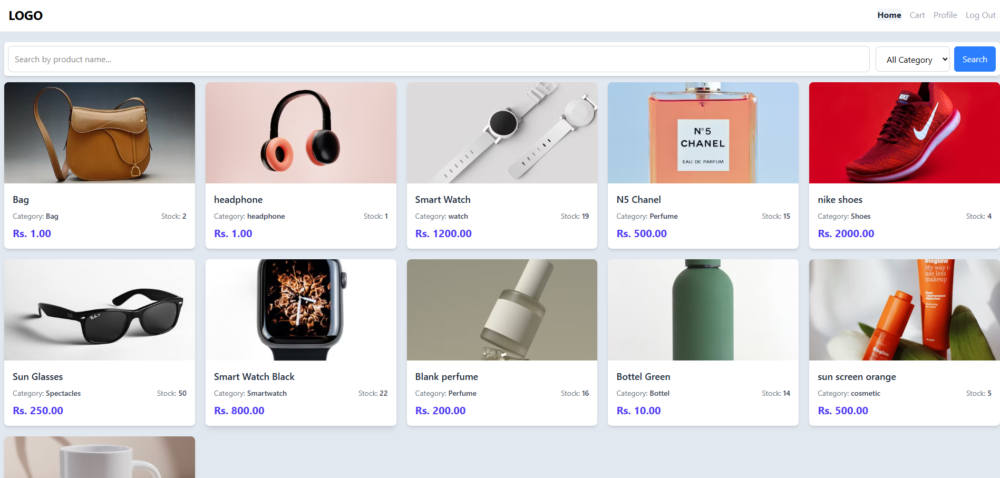

# 🛒 E-Commerce Web Application

This project `ecommercePHP` is a comprehensive **e-commerce platform** designed for both customers and administrators. It allows users to browse *products*, add items to a *shopping cart*, and place *orders*. Payments can be processed securely through the **Khalti digital wallet** integration, and administrators have tools to manage *product inventory*, track *sales*, and update *order statuses*.
<br><br>
For More **Detail** Explanation of System visit : **[Overview of ecommercePHP](Detail%20Md/Overview_of_ecommercePHP.md)** document.

## ✨ Features

- 👤 User registration and login
- 🛍️ Product listing and details
- 🛒 Shopping cart
- 📦 Order placement and order history
- 🛠️ Admin dashboard for managing products and orders
- 💳 Khalti Payment Gateway (KPG) integrated
- 🔒 Security: Password Hashing
- 📱 Responsive Design
<br>
---
<br>

## 🚀 Getting Started
To run this PHP project, you will need:

- [XAMPP](https://www.apachefriends.org/index.html) (or any local server environment with Apache, PHP, and MySQL)
- PHP 7.4 or higher
- MySQL 5.7 or higher
- A web browser

**Make sure to:**
- Start Apache and MySQL from the XAMPP control panel.
- Place the project folder inside the `htdocs` directory of your XAMPP installation.
- Import the provided SQL file into your MySQL server.
  
## 🛠️ Installation Guide

1. **Clone the repository:**
   ```
   git clone https://github.com/Aatish250/ecommercePHP.git
   ```

2. **Import the database:**
   - Import the SQL file located at `db/ecom_db.sql` into your MySQL server.

3. **Configure the application:**
   - Update database credentials in `config/db.php`.

4. **Run the application:**
   - Open [http://localhost/ecommercePHP/](http://localhost/ecommercePHP/) in your browser.

5. **Create Admin Account:**
<br>By default, no admin account is created. To create an admin account, follow the steps below:
   - Open `create_admin.php` via direct URL
   - Fill the provided form and submit.
<br>

## 📁 Directory Overview (Structure)

```
.
├── change_password.php 
├── create_admin.php            # For creating admin account
├── index.php                   # Log-in/Sign-up page
├── components
│   ├── admin_nav.php
│   ├── flashMessage.php
│   ├── link_imports.php
│   ├── show_flash_message.php
│   └── user_nav.php
├── config
│   ├── db.php                  # Database Connection
│   └── verify_session.php      # Authentations
├── db
│   └── ecom_db.sql             # Database Sql
├── img
│   ├── logo
│   └── product                 # Directory for Uploaded Images
├── src
│   ├── input.css
│   └── output.css
├── user                        # Directory for User
│   ├── cart.php
│   ├── checkout.php
│   ├── edit-profile.php
│   ├── homepage.php
│   ├── khalti-callback.php
│   ├── khalti-payment.php
│   ├── order-confirmation.php
│   ├── order-tracking.php
│   ├── proccess
│   │   ├── cart_table.php
│   │   └── home_products.php
│   ├── product_detail.php
│   └── profile.php
├── admin                       # Directory for Admin
│   ├── dashboard.php
│   ├── inventory.php
│   ├── order-details.php
│   ├── orders.php
│   ├── proccess
│   │   ├── add_product.php
│   │   ├── inventory_products.php
│   │   └── orders_ajax.php
│   ├── sales.php
│   ├── user-profile.php
│   └── users.php
└── README.md
```
<br>

## 🖼️ Project Preview
Dashboard:

homepage:

<br>
<a href="Detail Md/more_image.md" style="display: inline-block; padding: 10px 20px; background-color: #22272e; color: #adbac7; border-radius: 6px; text-decoration: none; font-weight: 600; margin-top: 10px; border: 1px solid #373e47; box-shadow: 0 1px 0 #373e47;">🖼️ See More...</a>
<br>
## 👨‍💻 Author

**Aatish** - Full Stack Developer

## 🙏 Acknowledgments

- Khalti for payment gateway integration
- Appache for Local/Web Hosting
- MYSQL for database hosting

## ☎️ Support

For support and questions:
- Create an issue in the GitHub repository
- Contact: machamasi321@gmail.com

---

**Note**: This is a production-ready e-commerce platform with all essential features for running an online store. Make sure to configure all environment variables and payment credentials before deployment.